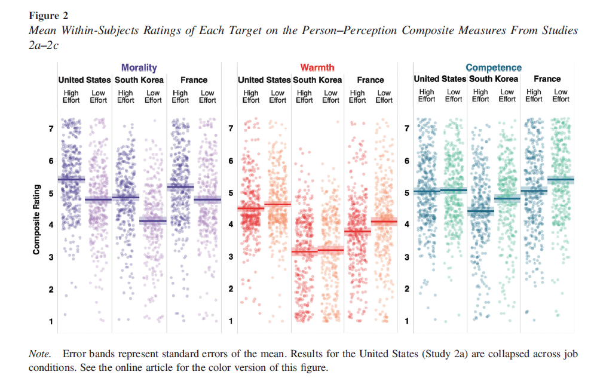
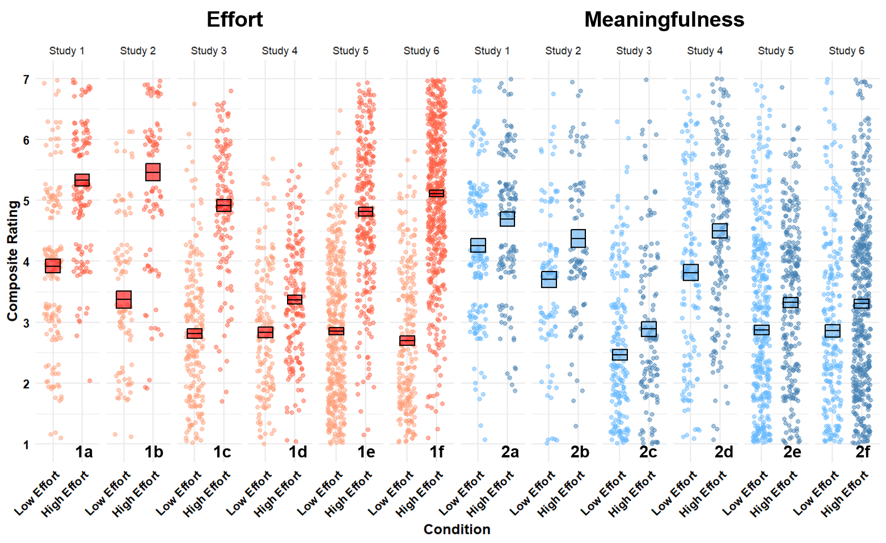
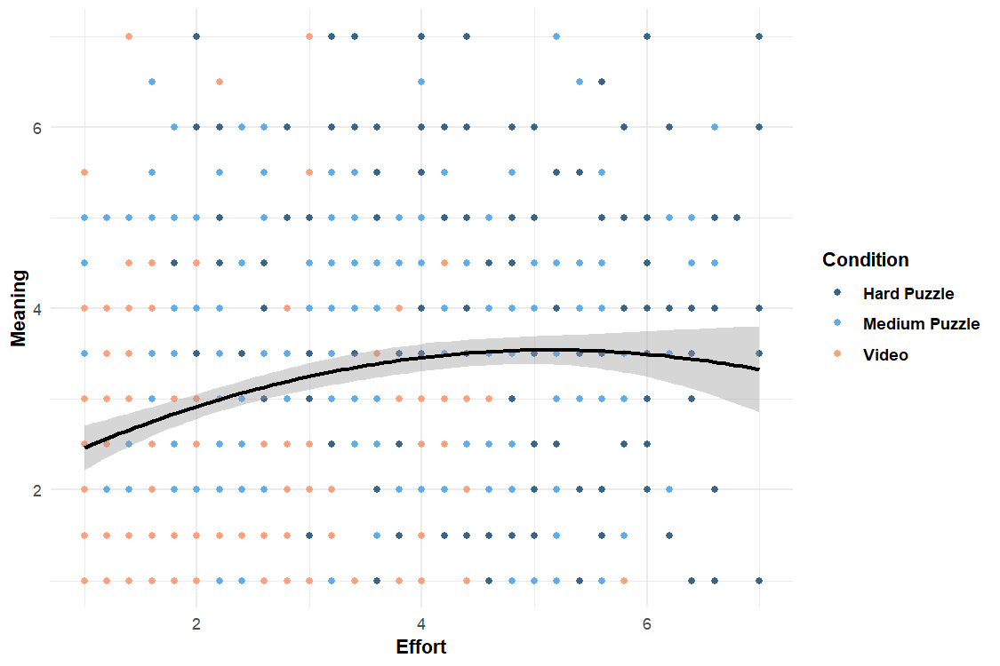
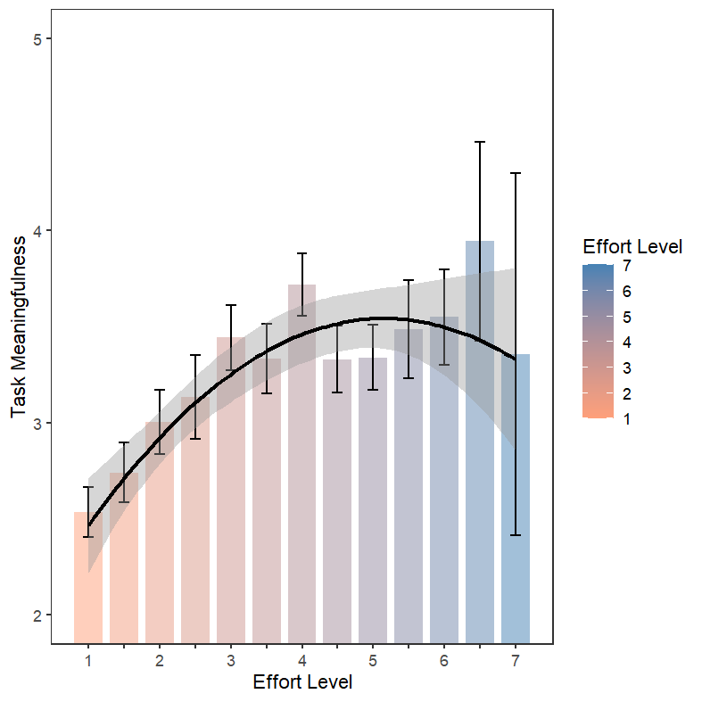

# Data Visualization

## Assignment 2: Good and Bad Data Visualization

### Requirements:

- Data visualizations are important tools for communication and convincing; we need to be able to evaluate the ways that data are presented in visual form to be critical consumers of information 
- To test your evaluation skills, locate two public data visualizations online, one good and one bad  
    - You can find data visualizations at https://public.tableau.com/app/discover or https://datavizproject.com/, or anywhere else you like! 
- For each visualization (good and bad):  
    - GOOD
    - Explain (with reference to material covered up to date, along with readings and other scholarly sources, as needed) why you classified that visualization the way you did.

    - Original Visualization
    

    - My Version
    
      ```
      
      
      Your answer... This visualization comes from a study I also really liked (Celniker et al., 2023; doi: 
      https://doi.org/10.1037/xge0001259). In fact, I ran into the lead author at a conference recently and 
      asked to semi-replicate the figure in my own (recently) published study (Campbell et al., 2025; doi: 
      https://doi.org/10.1016/j.cognition.2025.106065). He did not have to code available online, but I was 
      able to recreate the spirit of it through several hours of trial and error.
      
          
      Explanation: I'm going to speak to the first graph I pointed to and not my own version. Purely in 
      terms of the aesthetic qualities, I really like the organization and colouring of the content in this 
      visual. I think the colours are pleasant and intuitive (e.g., darker colours matched to "high effort" 
      groups on a white background; Franconeri et al., 2021; doi: https://doi.org/10.1177/
      15291006211051956). The colours also "feel right" for the constructs they represent (e.g., red-ish 
      for warmth, the others being more ambiguous but still look good). However, I'll comment again on the 
      colouring in the improvement part. In terms of substantiveness, the graph clearly communicates a lot 
      of information in a really honest way. The full likert range (1-7) for each construct is shown, along 
      with means and SE around the means. The use of scatterplots within each group gives an additional 
      view of the variability across goups (and samples). Each sample was recruited in a separate nation, 
      so visually eparating these out is both more transparent and shows meaningful variability or 
      differences across countries (as opposed to simply combining all samples). Regarding the perceptual 
      component, I think the message was immediately clear to me when first reading (of course, a very 
      basic understanding of the design is important). In terms of judgments of others, across countries 
      people commonly view those who exert more effort as being more morally virtuous, but this level of 
      cross-national findings doesn't extend to judgments of competency or warmth.


      ```
    - How could this data visualization have been improved?  
      ```
      Your answer... I find it tricky to criticize this visual outisde of it obviously being a lot of 
      information to parse, but at the same time - it seems to handle a lot of information really well. I 
      ended up adapting it as we had about 6 or 7 studies at the time and I wanted a strong summative 
      figure which demonstrated a consistent finding across a lot of contexts and samples. I will note, the 
      colour choice, while I like it, leaves me with some accessibility concerns and the two "less" 
      relevant constructs use green and red - problematic colours for the most common form of 
      colourblindness. It does get around this a little bit as the figure is tuned to be viewed in 
      greyscale (e.g., colour AND labeling differentiate groups). Still, better colours could be used. I 
      also believe having the "high effort" to the left of "low effort" is counter-intuitive for the sake of expecting lower values to the left and high values to the right (I ended up changing this in my 
      verion). The final smaller thing is that I prefer a more clearer region for displaying error 
      variance. This figure used a blurred region, we opted for a clearly outlined box plot on the graph. I 
      think the blurred approach with matching colours makes it a little trickier to see the value for mean 
      and SE.


      
      ```
    - BAD
    - Explain (with reference to material covered up to date, along with readings and other scholarly sources, as needed) why you classified that visualization the way you did.
    - Bad viz I submitted
    

    - My recent adjustments
    
      ```
      
      Your answer... If I may slightly roast my own decisions, this was/is a graph in a paper I submitted
       to a journal just before the DSI course. I thankfully got a revise and resubmit recently and will be
       changing the figure ASAP to be easily digestible. Surprisingly, reviewers took no issue with it, but 
       in terms of the three qualities we reviewed, I think it at best does an okay job at one 
       (substantive). In terms of aesthetics, the colouring doesn't match the manipulation/groups (Low 
       effort - Video, Medium effort puzzle - high effort puzzle). The colours aren't clearly related here 
       and could've easily been a gradient. Because of this, the scatterplot looks really wonky with 
       colours everywhere. The black curvilinear fitted plot could also better match the colour scheme (if 
       there were one). Related to the prior points, the perceptual piece is not good. The colours being 
       all over the places makes it hard to parse group differences - honestly this information isn't even 
       that helpful anyways as the main point was correlating self-reported effort with meaning. The 
       distribution of the data leads to the entire scatter plot being almost a matrix of dots (again, 
       really hard to parse through). My only "saving grace" is that the data is accurately presented if 
       you have the patience to parse it. I used the full scale and included all points of data from our 
       sample. 


      ```
    - How could this data visualization have been improved?  
      ```
      Your answer... I intend on changing this from a scatter plot to a bar plot (I attached a draft 
      version above that I'm working on). I'm willingly sacrificing some "honesty" in terms of presenting 
      averages because I think aggregated information is just as valuable here anyways. In addition, I 
      would want to keep error bars to still show variability. I also made the decision to bin the bar 
      plots a little more aggressively as I have limited data at the very high effort levels and my goal is 
      to just show an overall trend with this plot. In this revised version I made (the day prior to the 
      due date), I've switched up the colouring to be a gradient scale moving from pale red to dark blue 
      (low to high effort ratings). Removing the group-based colour format made the graph immediately more 
      clear. I also think the scatterplot provided far too much useless information. This graph, albeit not 
      perfect, much more clearly communicates the extent to which effort and meaning might relate in a 
      curvilinear way. It's no longer a matrix of dots and, instead, gives  sense of how meaningful 
      different levels of exertion tends to feel. Overall, I think this greatly improved the aesthetics and 
      perceptual aspects with limited sacrifice to the substantive piece. I still will likely tweak or 
      remove the line plot as it doessn't feel like it adds a lot, but here I like it as black to contrast 
      it against the bar plot's colour scale.

  


      
      ```
- Word count should not exceed (as a maximum) 500 words for each visualization (i.e. 
300 words for your good example and 500 for your bad example)

### Why am I doing this assignment?:

- This assignment ensures active participation in the course, and assesses the learning outcomes
* Apply general design principles to create accessible and equitable data visualizations
* Use data visualization to tell a story

### Rubric:

| Component               | Scoring   | Requirement                                                 |
|-------------------------|-----------|-------------------------------------------------------------|
| Data viz classification and justification | Complete/Incomplete | - Data viz are clearly classified as good or bad<br />- At least three reasons for each classification are provided<br />- Reasoning is supported by course content or scholarly sources |
| Suggested improvements  | Complete/Incomplete | - At least two suggestions for improvement<br />- Suggestions are supported by course content or scholarly sources |

## Submission Information

🚨 **Please review our [Assignment Submission Guide](https://github.com/UofT-DSI/onboarding/blob/main/onboarding_documents/submissions.md)** 🚨 for detailed instructions on how to format, branch, and submit your work. Following these guidelines is crucial for your submissions to be evaluated correctly.

### Submission Parameters:
* Submission Due Date: `23:59 - 30/04/2025`
* The branch name for your repo should be: `assignment-2`
* What to submit for this assignment:
    * This markdown file (assignment_2.md) should be populated and should be the only change in your pull request.
* What the pull request link should look like for this assignment: `https://github.com/<your_github_username>/visualization/pull/<pr_id>`
    * Open a private window in your browser. Copy and paste the link to your pull request into the address bar. Make sure you can see your pull request properly. This helps the technical facilitator and learning support staff review your submission easily.

Checklist:
- [ ] Create a branch called `assignment-2`.
- [ ] Ensure that the repository is public.
- [ ] Review [the PR description guidelines](https://github.com/UofT-DSI/onboarding/blob/main/onboarding_documents/submissions.md#guidelines-for-pull-request-descriptions) and adhere to them.
- [ ] Verify that the link is accessible in a private browser window.

If you encounter any difficulties or have questions, please don't hesitate to reach out to our team via our Slack. Our Technical Facilitators and Learning Support staff are here to help you navigate any challenges.
