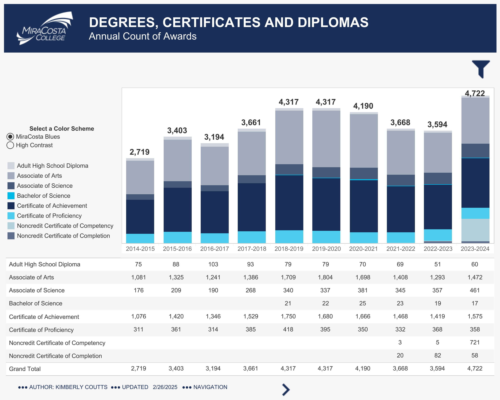
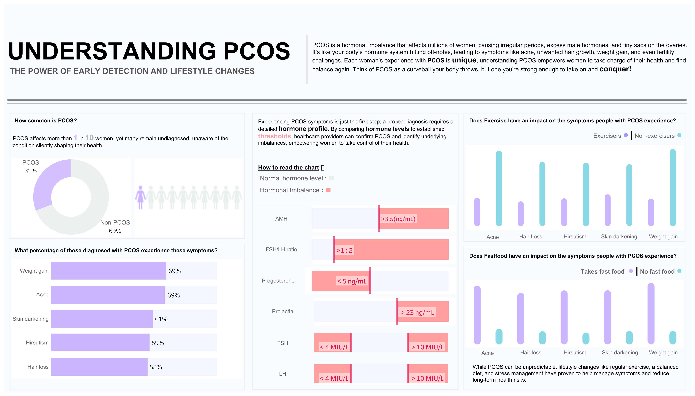

# Data Visualization

## Assignment 2: Good and Bad Data Visualization

### Requirements:

- Data visualizations are important tools for communication and convincing; we need to be able to evaluate the ways that data are presented in visual form to be critical consumers of information 
- To test your evaluation skills, locate two public data visualizations online, one good and one bad  
    - You can find data visualizations at https://public.tableau.com/app/discover or https://datavizproject.com/, or anywhere else you like! 
- For each visualization (good and bad):  
    - Explain (with reference to material covered up to date, along with readings and other scholarly sources, as needed) why you classified that visualization the way you did.
      ```
      Your answer...


      ```
    - How could this data visualization have been improved?  
      ```
      Your answer...


      ```
- Word count should not exceed (as a maximum) 500 words for each visualization (i.e. 
300 words for your good example and 500 for your bad example)


### Answers Below

# Assignment 2: Good and Bad Data Visualization

## GOOD VISUALIZATION  
### MiraCosta College — Annual Degrees and Certificates Dashboard  
**Classification:** Good Visualization  
**Visualization link:** [Annual Degrees and Certificates by MiraCosta College (Tableau Public)](https://public.tableau.com/app/profile/mcc.rpie/viz/AnnualDegreesandCertificates_16487718324400/Awards)

---

### Strengths

#### 1. Clear Encoding
- Uses simple horizontal bar charts to represent annual degrees and certificates.  
- Why it works: Bar length is easy to interpret; aligns with Cleveland & McGill (1984) on accurate visual perception.

#### 2. Low Cognitive Load
- Minimal colors, clear labels, and no decorative icons.  
- Why it works: Reduces effort for the viewer to understand trends (Few, 2004).

#### 3. High Data-Ink Ratio
- No chartjunk; focus remains on trends in degree completions.  
- Why it works: Maximizes meaningful data visualization (Tufte, 1983).

#### 4. Effective Story
- Trends over time are immediately visible; increases or dips can be interpreted at a glance.  
- Why it works: The viewer can quickly understand the main message without extra effort.


### Improvements

1. Add a short subtitle summarizing the main takeaway (e.g., “Degrees increased 15% since 2015”).  
2. Introduce filters (by program or gender) for interactive, deeper insight without overcrowding the design.  

---


## BAD VISUALIZATION  
### PCOS Dashboard
**Classification:** Bad Visualization  
**Visualization link:** [PCOS Dashboard by Jennifer Eneh (Tableau Public)](https://public.tableau.com/app/profile/jennifer.eneh/viz/PCOSDashboard_17297311153800/pcosdashboard)



---

### Issues

#### 1. Perceptual Inaccuracies
- Uses icons, circle sizes, and radial graphics to represent quantitative values.  
- Problem: Humans are poor at judging area, volume, or angles accurately (Cleveland & McGill, 1984).  
- Result: Viewers can misinterpret prevalence, hormone levels, or other metrics.

#### 2. Cognitive Overload and Poor Hierarchy
- Multiple charts, icons, and text blocks compete for attention.  
- Problem: Viewers don’t know where to look first; unrelated facts get equal visual weight (Few, 2004).  
- Result: Hard to grasp main insights “at a glance.”

#### 3. Misuse of Color and Decorative Elements
- Bright pastels, gradients, and figure icons are decorative rather than informative.  
- Problem: Reduces the data-ink ratio and distracts from key messages (Tufte, 1983).  
- Result:Visual clutter; inconsistent color encoding adds ambiguity.

#### 4. Lack of Context and Benchmarks
- Statistics like “1 in 10 women affected” lack comparative or temporal reference.  
- Problem: Viewers cannot interpret significance without context (“Compared to what?”).  
- Result: Graphic functions more as a poster than as an analytic tool.

#### 5. Credibility and Clarity Issues
- Missing data sources and inconsistent typography reduce trustworthiness and readability.


---


### Improvements

1. Replace icons with bar or line charts on a shared scale to display prevalence or hormone levels accurately.  
2. Group content under clear categories (Prevalence, Symptoms, Lifestyle) to create hierarchy.  
3. Use fewer colors and consistent labels for readability.  
4. Add reliable data sources and short captions explaining each insight.  

---

## References

Cleveland, W. S., & McGill, R. (1984). *Graphical perception: Theory, experimentation, and application to the development of graphical methods.* *Journal of the American Statistical Association, 79*(387), 531–554.  

Few, S. (2004). *Show Me the Numbers: Designing Tables and Graphs to Enlighten.* Analytics Press.  

Tufte, E. R. (1983). *The Visual Display of Quantitative Information.* Graphics Press.  


### Why am I doing this assignment?:

- This assignment ensures active participation in the course, and assesses the learning outcomes
* Apply general design principles to create accessible and equitable data visualizations
* Use data visualization to tell a story

### Rubric:

| Component               | Scoring   | Requirement                                                 |
|-------------------------|-----------|-------------------------------------------------------------|
| Data viz classification and justification | Complete/Incomplete | - Data viz are clearly classified as good or bad<br />- At least three reasons for each classification are provided<br />- Reasoning is supported by course content or scholarly sources |
| Suggested improvements  | Complete/Incomplete | - At least two suggestions for improvement<br />- Suggestions are supported by course content or scholarly sources |

## Submission Information

🚨 **Please review our [Assignment Submission Guide](https://github.com/UofT-DSI/onboarding/blob/main/onboarding_documents/submissions.md)** 🚨 for detailed instructions on how to format, branch, and submit your work. Following these guidelines is crucial for your submissions to be evaluated correctly.

### Submission Parameters:
* Submission Due Date: `23:59 - 10/26/2025`
* The branch name for your repo should be: `assignment-2`
* What to submit for this assignment:
    * This markdown file (assignment_2.md) should be populated and should be the only change in your pull request.
* What the pull request link should look like for this assignment: `https://github.com/<your_github_username>/visualization/pull/<pr_id>`
    * Open a private window in your browser. Copy and paste the link to your pull request into the address bar. Make sure you can see your pull request properly. This helps the technical facilitator and learning support staff review your submission easily.

Checklist:
- [ ] Create a branch called `assignment-2`.
- [ ] Ensure that the repository is public.
- [ ] Review [the PR description guidelines](https://github.com/UofT-DSI/onboarding/blob/main/onboarding_documents/submissions.md#guidelines-for-pull-request-descriptions) and adhere to them.
- [ ] Verify that the link is accessible in a private browser window.

If you encounter any difficulties or have questions, please don't hesitate to reach out to our team via our Slack. Our Technical Facilitators and Learning Support staff are here to help you navigate any challenges.
