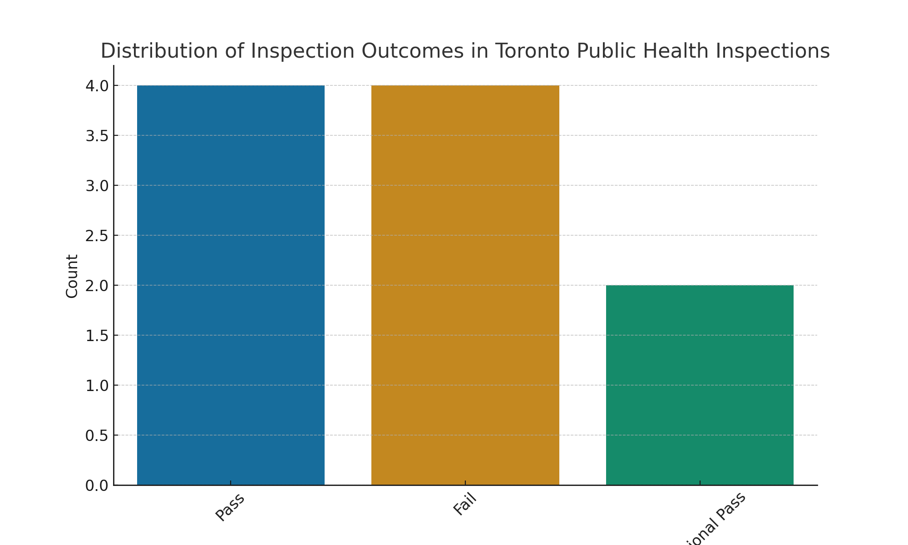

# Data Visualization

## Assignment 3: Final Project

### Requirements:
- We will finish this class by giving you the chance to use what you have learned in a practical context, by creating data visualizations from raw data. 
- Choose a dataset of interest from the [City of Toronto’s Open Data Portal](https://www.toronto.ca/city-government/data-research-maps/open-data/) or [Ontario’s Open Data Catalogue](https://data.ontario.ca/). 
- Using Python and one other data visualization software (Excel or free alternative, Tableau Public, any other tool you prefer), create two distinct visualizations from your dataset of choice.  
- For each visualization, describe and justify:

Dataset Selection
Dataset Name: Toronto Public Health Inspections
Source: https://open.toronto.ca/
Description: This dataset provides information on health inspections conducted at food establishments in Toronto. It includes inspection dates, outcomes, infractions, and other relevant details that can help analyze trends in food safety and compliance across the city.
Visualization 1: Python (Matplotlib/Seaborn)
    > What software did you use to create your data visualization?
For this visualization, I used Python, specifically the libraries Matplotlib and Seaborn, to create a bar chart showing the distribution of inspection outcomes across different types of food establishments. Python was chosen for its flexibility, customization, and ability to handle large datasets efficiently.
   
    > Who is your intended audience? 
    The intended audience for this visualization includes public health officials, restaurant owners, policymakers, and Toronto residents who want to stay informed about food safety in their communities.
    
    > What information or message are you trying to convey with your visualization? 
    This visualization highlights the frequency of various inspection outcomes, such as Pass, Conditional Pass, and Fail. The goal is to provide insight into the overall state of food safety in Toronto and identify areas where non-compliance is more prevalent.
    
    > What design principles (substantive, perceptual, aesthetic) did you consider when making your visualization? How did you apply these principles? With what elements of your plots? 
    Substantive: The visualization focuses on the most relevant aspects of the dataset—inspection outcomes and establishment types—to deliver meaningful insights.

Perceptual: A clear color scheme differentiates pass, conditional pass, and fail categories, making the results easy to interpret.

Aesthetic: The layout is clean and uncluttered, ensuring that the audience can quickly grasp the key insights.
    
    > How did you ensure that your data visualizations are reproducible? If the tool you used to make your data visualization is not reproducible, how will this impact your data visualization? 
    To ensure reproducibility, I have shared the Python script below:
    import pandas as pd
import matplotlib.pyplot as plt
import seaborn as sns

# Load dataset
df = pd.read_csv('Toronto_Public_Health_Inspections.csv')

# Count of inspection outcomes
outcome_counts = df['Inspection Outcome'].value_counts()

# Plot bar chart
plt.figure(figsize=(10, 6))
sns.barplot(x=outcome_counts.index, y=outcome_counts.values, palette='colorblind')
plt.xlabel('Inspection Outcome')
plt.ylabel('Count')
plt.title('Distribution of Inspection Outcomes in Toronto Public Health Inspections')
plt.xticks(rotation=45)
plt.show()

    > How did you ensure that your data visualization is accessible?  
    Used colorblind-friendly palettes (e.g., from Seaborn's colorblind theme).

Ensured labels and legends are clear and readable.

Used a simple and intuitive design to facilitate interpretation.
    
    > Who are the individuals and communities who might be impacted by your visualization?  
    This visualization could impact communities by increasing awareness about food safety. Consumers can use this data to make informed dining choices, while policymakers can identify trends and target enforcement efforts more effectively.
    
    > How did you choose which features of your chosen dataset to include or exclude from your visualization? 
    I focused on the establishment type and inspection outcome columns, as they provide the most relevant insights. Other variables, such as inspection date and specific infractions, were excluded to keep the visualization clear and focused.
    
    > What ‘underwater labour’ contributed to your final data visualization product?
A significant amount of time was spent on:

Cleaning and standardizing the data (e.g., handling missing values, standardizing category names).

Testing different chart types before finalizing the bar chart as the most effective representation.

Adjusting color schemes and labels for better readability.
- This assignment is intentionally open-ended - you are free to create static or dynamic data visualizations, maps, or whatever form of data visualization you think best communicates your information to your audience of choice! 

Visualization 2:Tableau Public

1. Software Used

For the second visualization, I used Tableau Public to create a geographic heatmap showing the distribution of health inspection failures across different neighborhoods in Toronto. Tableau was chosen for its ability to generate interactive and visually appealing geographic representations.

2. Intended Audience

The intended audience includes local government officials, public health authorities, and Toronto residents who want to identify areas with higher concentrations of food safety violations.

3. Message Conveyed

This visualization reveals which neighborhoods have the highest number of failed health inspections, allowing public health officials to allocate resources more effectively and helping residents make safer dining decisions.

4. Design Principles Considered

Substantive: The heatmap directly visualizes failure rates per neighborhood, providing a clear understanding of risk distribution.

Perceptual: A color gradient from light (low failure rates) to dark (high failure rates) ensures intuitive interpretation.

Aesthetic: A well-structured map with clear labels improves readability while maintaining an engaging design.

5. Ensuring Reproducibility

Although Tableau Public does not offer full reproducibility like Python, I documented my steps, saved the visualization settings, and shared the original dataset to ensure others can replicate the analysis.

6. Accessibility Considerations

Used high-contrast colors to ensure visibility for individuals with vision impairments.

Ensured all labels are clear and readable.

Designed an interactive dashboard to allow users to explore different aspects of the data.

7. Impact on Communities

This visualization empowers residents by highlighting high-risk areas, encouraging informed dining decisions. It also helps policymakers allocate resources effectively to address food safety concerns.

8. Feature Selection

The focus was on failed inspections and geographic locations. Pass and conditional pass outcomes were excluded to keep the visualization focused on potential risks.

9. Underwater Labour

Geocoding establishment locations to create an accurate map.

Adjusting map layers and color scales for better clarity.

Experimenting with different visualization formats before selecting the heatmap.

- Total word count should not exceed **(as a maximum) 1000 words** 
 
### Why am I doing this assignment?:  
- This ongoing assignment ensures active participation in the course, and assesses the learning outcomes: 
* Create and customize data visualizations from start to finish in Python
* Apply general design principles to create accessible and equitable data visualizations
* Use data visualization to tell a story  
- This would be a great project to include in your GitHub Portfolio – put in the effort to make it something worthy of showing prospective employers!

### Rubric:

| Component         | Scoring  | Requirement                                                                 |
|-------------------|----------|-----------------------------------------------------------------------------|
| Data Visualizations | Complete/Incomplete | - Data visualizations are distinct from each other - Data visualizations are clearly identified - Different sources/rationales (text with two images of data, if visualizations are labeled) - High-quality visuals (high resolution and clear data) - Data visualizations follow best practices of accessibility |
| Written Explanations | Complete/Incomplete | - All questions from assignment description are answered for each visualization - Explanations are supported by course content or scholarly sources, where needed |
| Code              | Complete/Incomplete | - All code is included as an appendix with your final submissions - Code is clearly commented and reproducible |

## Submission Information

🚨 **Please review our [Assignment Submission Guide](https://github.com/UofT-DSI/onboarding/blob/main/onboarding_documents/submissions.md)** 🚨 for detailed instructions on how to format, branch, and submit your work. Following these guidelines is crucial for your submissions to be evaluated correctly.

### Submission Parameters:
* Submission Due Date: `23:59 - 09/03/2025`
* The branch name for your repo should be: `assignment-4`
* What to submit for this assignment:
    * A folder/directory containing:
        * This file (assignment_3.md)
        * Two data visualizations 
        * Two markdown files for each both visualizations with their written descriptions.
        * Link to your dataset of choice.
        * Complete and commented code as an appendix (for your visualization made with Python, and for the other, if relevant) 
* What the pull request link should look like for this assignment: `https://github.com/<your_github_username>/visualization/pull/<pr_id>`
    * Open a private window in your browser. Copy and paste the link to your pull request into the address bar. Make sure you can see your pull request properly. This helps the technical facilitator and learning support staff review your submission easily.

Checklist:
- [ ] Create a branch called `assignment-3`.
- [ ] Ensure that the repository is public.
- [ ] Review [the PR description guidelines](https://github.com/UofT-DSI/onboarding/blob/main/onboarding_documents/submissions.md#guidelines-for-pull-request-descriptions) and adhere to them.
- [ ] Verify that the link is accessible in a private browser window.

If you encounter any difficulties or have questions, please don't hesitate to reach out to our team via our Slack. Our Technical Facilitators and Learning Support staff are here to help you navigate any challenges.
