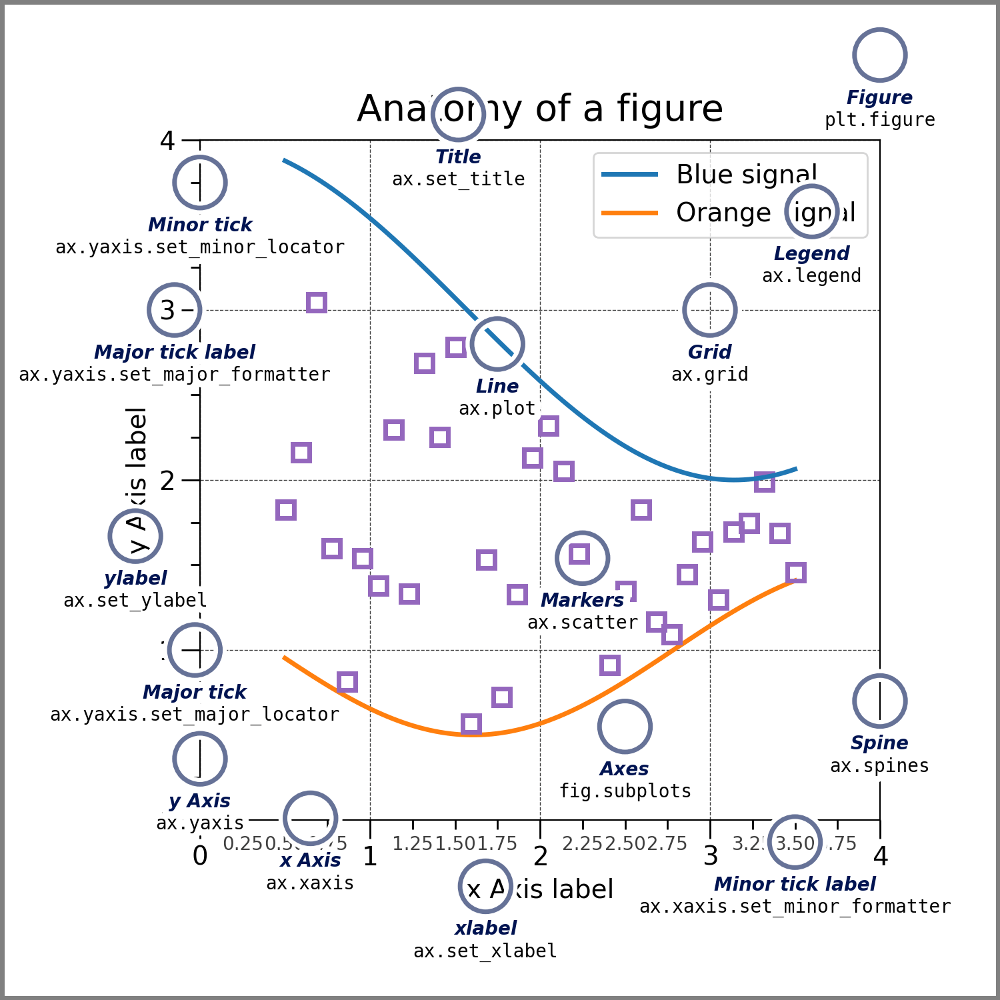

# Data Visualization: Customizing Our Plots

```code
$ echo "Data Science Institute"
```

---

# Today we will...

- Make more modifications to our plots using Matplotlib, including
    - Legends
    - Annotations (text, shapes, and labels)
    - Axis Labels
    - Styles
---

# Legends

---

# Set up

- Just like before, let’s start by loading our libraries and making some sample data
    ```
    import numpy as np
    import matplotlib.pyplot as plt
    import pandas as pd
    import scipy
    import PIL
    import requests

    np.random.seed(613)
    x = np.arange(50)
    y1 = np.random.randint(0, 100,50)
    y2 = np.random.randint(0, 100,50)
    ```
---

# Activity: Recall

- Using what we learned in lesson 2, can you make a line plot with both of our y variables on the same axes?


---
# Activity: Recall

- Using what we learned in lesson 2, can you make a line plot with both of our y variables on the same axes?
    ```
    fig, ax = plt.subplots(figsize=(5, 3))
    ax.plot(x,y1)
    ax.plot(x,y2)
    fig.show()
    ```
---

# Adding a legend

- To add a legend, we:
    - Add a ‘label’ argument to each plot object
    - Call ‘legend’ and specify our legend location
    ```
    fig, ax = plt.subplots(figsize=(5, 3))
    ax.plot(x,y1, label = "Person 1" )
    ax.plot(x,y2, label = "Person 2" )
    ax.legend(loc='lower right')
    fig.show()
    ```

---

# Modifying our legend

- By adding arguments to our legend object, we can change different elements of our legend
    ```
    fig, ax = plt.subplots(figsize=(5, 3))
    ax.plot(x,y1, label = "Person 1")
    ax.plot(x,y2, label = "Person 2")
    ax.legend(loc='lower right',
            frameon = True, #add frame around the legend
            fontsize = 12, #change font size
            ncol = 2, #specify number of columns
            shadow = True )
    fig.show()
    ```
---

# Moving the legend outside of the plot area

- We can position the legend outside of our plot by
    - Specifying legend location as before
    - Specifying where we want to anchor that location _on our figure_ using **bbox_to_anchor** 
    ```
    fig, ax = plt.subplots(figsize=(5, 3))
    ax.plot(x,y1, label = "Person 1")
    ax.plot(x,y2, label = "Person 2")
    ax.legend(loc=‘upper left’,
            bbox_to_anchor =(1, 1))
    fig.show()
    ```
---

# Text and Annotations

---

# Annotations with the text() function

- Let’s start by putting our data into a scatter plot this time
    ```
    fig, ax = plt.subplots(figsize=(5, 3))
    ax.scatter(x,y1, label = "Person 1")
    ax.scatter(x,y2, label = "Person 2")
    ax.legend(loc='lower right')
    ```
- Then use the text() function to specify coordinates and text
    ```
    ax.text(10, 95, "This value is important!")
    fig.show()
    ```
---

# Modifying text annotations

- Just like before, we can modify our text annotation by adding arguments
    ```
    ax.text(10, 95, "This value is important!",
          ha='center',    ##alignment of text
          color = 'red',  ##modify font colour
          size = 20)      ##modify font size

    fig.show()
    ```
---

# Positioning text annotations

- Just now, we located our text annotation using the coordinates of data points
- If we want our annotation linked to a fixed spot, we can locate it at a specific location on our _axes_ or the _figure_ itself (recall our matplotlib terminology)

    

---
# Positioning text annotations

- We can do this using **transforms**
- Start by making a simple, empty set of axes
    ```
    fig, ax = plt.subplots()
    ax.axis([0, 10, 0, 10])
    ```
- Then we can position our annotation with reference to the data (like before), the axes, or the figure (referencing axis/figure dimensions)
    ```
    ax.text(1, 5, ". Data:(1, 5)",           transform=ax.transData    )
    ax.text(0.5, 0.1, ". Axes:(0.5, 0.1)",   transform=ax.transAxes    )
    ax.text(0.2, 0.2, ". Figure:(0.2, 0.2)", transform=fig.transFigure )
    ```
---
# Positioning text annotations


```
ax.text(1, 5, ". Data: (1, 5)",           transform=ax.transData    )
ax.text(0.5, 0.1, ". Axes: (0.5, 0.1)",   transform=ax.transAxes    )
ax.text(0.2, 0.2, ". Figure: (0.2, 0.2)", transform=fig.transFigure )
```
---

# Annotating with arrows

- We can use the **annotate()** function to annotate with arrows and text (e.g. to focus at a specific point)
    - We have to specify the location to point at **and** the location where we want our text
    ```
    fig, ax = plt.subplots(figsize=(5, 3))
    ax.scatter(x,y1, label = "Person 1")
    ax.scatter(x,y2, label = "Person 2")
    ax.legend(loc='lower right')

    ax.annotate('This is important!', xy=(10, 95), xytext=(20, 94),
              arrowprops=dict(facecolor='black', shrink=0.05))

    fig.show()
    ```
---

# Modifying arrows

- Use the **arrowprops** argument to adjust our arrow style and colour
    - Matplotlib documentation describes possible arrow styles ([https://matplotlib.org/3.1.1/api/_as_gen/matplotlib.pyplot.annotate.html](https://matplotlib.org/3.1.1/api/_as_gen/matplotlib.pyplot.annotate.html))
    - Try "->", "<->", "-[", "fancy"
    ```
    ax.annotate('This is important!’,
              xy=(10, 95), xytext=(20, 94),
              arrowprops = dict(arrowstyle = "wedge",
                                color = " hotpink "))

    fig.show()
    ```
---

# Axis Labels

---

# Removing tick marks and labels

- We can remove tick marks or labels from our axis like so:
    - Use **locator** to remove ticks and labels
    - Use **formatter** to remove only labels
    ```
    fig, ax = plt.subplots(figsize=(5, 3))
    ax.scatter(x,y1, label = "Person 1")
    ax.scatter(x,y2, label = "Person 2")
    ax.legend(loc='lower right')

    ax.yaxis.set_major_locator(plt.NullLocator()) 
    ax.xaxis.set_major_formatter(plt.NullFormatter()) 
    ```
---

# Limiting tick marks

- We can also define a maximum number of ticks we want on our axis
    ```
    fig, ax = plt.subplots(figsize=(5, 3))
    ax.scatter(x,y1, label = "Person 1")
    ax.scatter(x,y2, label = "Person 2")
    ax.legend(loc='lower right')
    ax.xaxis.set_major_locator(plt.MaxNLocator(3))
    ```
---

# Tick mark intervals

- We can set tick marks at a particular interval (in this case, 5) using MultipleLocator
    ```
    fig, ax = plt.subplots(figsize=(5, 3))
    ax.scatter(x,y1, label = "Person 1")
    ax.scatter(x,y2, label = "Person 2")
    ax.legend(loc='lower right')
    ax.xaxis.set_major_locator(plt.MultipleLocator(5))
    ```
---

# Rotating axis labels

- To rotate axis labels and horizontal alignment, use **xticks()**  
    ```
    fig, ax = plt.subplots(figsize=(5, 3))
    ax.scatter(x,y1, label = "Person 1")
    ax.scatter(x,y2, label = "Person 2")
    ax.legend(loc='lower right’)

    plt.xticks(rotation=45, ha='right')
    ```
- **Try modifying fontsize and font as well**
---

# Activity: Modifying axis title fonts

- Can you use what we did in a previous lesson to modify our x axis title?
    - We want a serif font with indigo colour, and for the axis title to be “Shiny New X Axis!”
    - Use plt.xlabel()
    - **HINT**: Recall fontdict

---

# Activity: Modifying axis title fonts

- Can you use what we did in a previous lesson to modify our x axis title?
    - We want a serif font with indigo colour, and for the axis title to be “Shiny New X Axis!”
    - Use plt.xlabel()
    - **HINT**: Recall fontdict
    ```
    font1 = {' family':'serif','color':'indigo'}
    fig, ax = plt.subplots(figsize=(5, 3))
    ax.scatter(x,y1, label = "Person 1")
    ax.scatter(x,y2, label = "Person 2")
    ax.legend(loc='lower right')
    plt.xlabel('Shiny New X Axis!', fontsize = 18, fontdict = font1)
    ```
---

# Styles

---

# What are styles

- Styles are a convenient way to change many aesthetic dimensions of our plots at the same time
- To view available pre-made styles, use:
    ```
    plt.style.available
    ```
- To use a style, just type the following before you make your figure:
    ```
    plt.style.use('fivethirtyeight')
    ```

---

# What are styles

```
plt.style.use('fivethirtyeight’)

np.random.seed(613)
x = np.arange(50)
y1 = np.random.randint(0, 100,50)
y2 = np.random.randint(0, 100,50)
fig, ax = plt.subplots(figsize=(5, 3))
ax.plot(x,y1)
ax.plot(x,y2)
fig.show()

```
- **Try using different styles and see how they change your plot!**

---

# Assignment 2

---

# Next...

- How do we choose the right data visualization for a given situation?
- What does it mean for data visualization to be ‘objective’?
- Perceptual qualities of data viz
