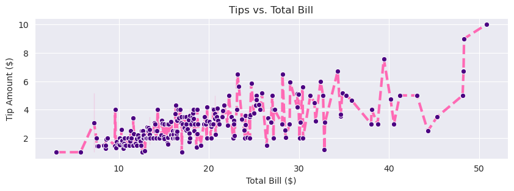
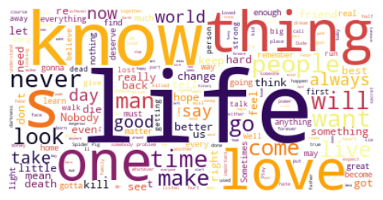

# Data Visualization: Beyond Matplotlib

```code
$ echo "Data Science Institute"
```
---

# Today we will...

- Learn about other packages to use for data visualization in Python, such as:
    - Seaborn
    - Plotly (for interactive viz)
    - Wordclouds and Venn Diagrams
- Discuss when to use (and when not to use) interactive data visualization

---

# Seaborn

---

# What is seaborn?

- A data viz package built on top of matplotlib

- REALLY SIMILAR to matplotlib (phew!) but takes care of some  **semantic mapping** for us

- Recall: mapping is deciding which aspects of our dataset correspond to which visual elements on our plots

---

# Install and load packages

- After installing seaborn, we can load all the packages we’ll be using in this lesson
    ```
    import seaborn as sns
    import numpy as np
    import matplotlib.pyplot as plt
    import pandas as pd
    import scipy
    import PIL
    import requests
    ```
---

# Load data

- We’re going to work with the ‘tips’ sample dataset, which is available as part of the seaborn (sns) package

    ```
    tips = sns.load_dataset("tips")
    print(tips)
    ```

- This dataset contains information about tips at a restaurant, including meal time, party size, gender of customer, total bill amount, and tip amount

---

# Basic plot

- Let’s make a simple line plot of tip amount vs total bill
    ```
    sns.lineplot(data=tips,       # choose our dataset
               x='total_bill',  # define our x variable
               y='tip')         # define our y variable
    ```
---

# Use premade styles

- We can use premade styles to alter the appearance of our plot

    ```
    sns.set_style('whitegrid')
    ```

- Try other preset styles like ‘darkgrid’, ‘whitegrid’, ‘dark’, ‘white’, ‘ticks’, then make our line plot again – how has it changed?

---

# Add title and axis labels

- Seaborn can do many of the same things as matplotlib, like adding labels We do this using the  **set.** function
    ```
    tipgraph = sns.lineplot(data=tips,
                            x='total_bill',
                            y='tip')

    tipgraph.set(title='Tips vs. Total Bill', 
                xlabel='Total Bill ($)', 
                ylabel='Tip Amount ($)')

    ```
---

# Modify aesthetic elements

- Like in base matplotlib, we can use the subplots function to change figure size

    ```
    fig = plt.subplots(figsize=(10, 3))
    ```

---
# Modify aesthetic elements

- We can also change colour, marker style, and line style
    ```
    tipgraph = sns.lineplot(data=tips,
                          x='total_bill',
                          y='tip',
                          color = 'hotpink',
                          linestyle = '--',
                          linewidth = 3,
                          marker = 'o',
                          markerfacecolor = 'indigo')
    ```

---

# Modify aesthetic elements



---

# BUT why is seaborn actually an improvement?

---

# Add multiple variables

- Seaborn makes it very easy to represent multiple variables with different visual elements of our graph
    ```
    tipgraph = sns.scatterplot(data=tips, x='total_bill',
                            y='tip’, style = 'time', hue = 
                            'day’, palette = ['purple’,
                            'hotpink', 'deepskyblue’,
                            'yellowgreen'])

    tipgraph.set(title='Tips vs. Total Bill',
                xlabel='Total Bill ($)',
                ylabel='Tip Amount ($)')
    ```

---

# Add multiple variables


---

# Pairplot

- **pairplot** is another convenient way to compare variables

```
sns.pairplot(
      data = tips,
      hue = 'day')
```


---

# Relplot

- **relplot** also lets us explore specific levels within variables

    ```
    daysplot = sns.relplot(
                data=tips,
                x="total_bill",
                y="tip",
                hue="sex",
                col="day",
                kind="scatter",
                col_wrap=2)
    ```
- **Activity**: Comment this snippet of code and describe what each new element is doing


---

# Seaborn resources:

- Datacamp has a seaborn cheatsheet that covers the basics: [https://images.datacamp.com/image/upload/v1676302629/Marketing/Blog/Seaborn_Cheat_Sheet.pdf](https://images.datacamp.com/image/upload/v1676302629/Marketing/Blog/Seaborn_Cheat_Sheet.pdf)

- Or look at the seaborn gallery: [http://seaborn.pydata.org/examples/index.html](http://seaborn.pydata.org/examples/index.html)

---

# Case Study: Gender bias in teaching evaluations

<!--
NOTES: 

-->
---

# How does faculty gender impact course evaluations?

- The gender of instructors ( _[perceived](https://link.springer.com/article/10.1007/s10755-014-9313-4)_  or  _[actual](https://www.cambridge.org/core/services/aop-cambridge-core/content/view/91670F6003965C5646680D314CF02FA4/S1049096519001744a.pdf/div-class-title-exploring-bias-in-student-evaluations-gender-race-and-ethnicity-div.pdf)_ ) influences how they are scored by students on teaching and course evaluations, with student evaluations tending to be significantly biased in favour of men and against women, even when all else is equal

- The bias in these student evaluations can adversely impact the ability of female scholars to be “full-time tenure-track, to hold tenured positions, to attain higher leadership roles in academia, and to earn the same salary as males in the same positions”


<!-- 
NOTES: 
The studies here focus on binary gender variables (male/female) and do not account for non-binary professors and course instructors; Medeiros, M., Forest, B., & Öhberg, P. (2020). The Case for Non-Binary Gender Questions in Surveys. PS: Political Science & Politics, 53(1), 128–135. https://doi.org/10.1017/S1049096519001203 raise the question of whether or not the inclusion of a non-binary/other option for gender questions on surveys may alter individuals’ evaluation of the survey

 
REFERENCES: 
Rivera, L. A., & Tilcsik, A. (2019). Scaling Down Inequality: Rating Scales, Gender Bias, and the Architecture of Evaluation. American Sociological Review, 84(2), 248–274. https://doi.org/10.1177/0003122419833601 
Chávez, K., & Mitchell, K. M. W. (2020). Exploring Bias in Student Evaluations: Gender, Race, and Ethnicity. PS: Political Science & Politics, 53(2), 270–274. https://doi.org/10.1017/S1049096519001744 
MacNell, L., Driscoll, A., & Hunt, A. N. (2015). What’s in a Name: Exposing Gender Bias in Student Ratings of Teaching. Innovative Higher Education, 40(4), 291–303. https://doi.org/10.1007/s10755-014-9313-4  -->

---

# Mean of Student Ratings by Actual and Perceived Instructor Gender (MacNell et al., 2015)


<!--
NOTES: 
This plot, taken from one of the studies cited on the previous slide, visualizes some data about student ratings of male and female course instructors for an online, asynchronous course (where they could be led to believe that a female instructor was male, and vice versa)
This graph resembles a lot of the other graphs we’ve made and evaluated during this module, and does a pretty good job (shows error intervals; data labels, clear font; grayscale likely because of journal formatting standards)
Opportunity for discussion/opinions


REFERENCES
MacNell, L., Driscoll, A., & Hunt, A. N. (2015). What’s in a Name: Exposing Gender Bias in Student Ratings of Teaching. Innovative Higher Education, 40(4), 291–303. https://doi.org/10.1007/s10755-014-9313-4  
-->

---

# Gendered Language in Teacher Reviews (Schmidt, 2015)


[🔗 source](http://benschmidt.org/profGender/#%7B%22database%22%3A%22RMP%22%2C%22plotType%22%3A%22pointchart%22%2C%22method%22%3A%22return_json%22%2C%22search_limits%22%3A%7B%22word%22%3A%5B%22professor%22%5D%2C%22department__id%22%3A%7B%22%24lte%22%3A25%7D%7D%2C%22aesthetic%22%3A%7B%22x%22%3A%22WordsPerMillion%22%2C%22y%22%3A%22department%22%2C%22color%22%3A%22gender%22%7D%2C%22counttype%22%3A%5B%22WordsPerMillion%22%5D%2C%22groups%22%3A%5B%22department%22%2C%22gender%22%5D%2C%22testGroup%22%3A%22D%22%7D)

<!--
NOTES: 
Have students open the link to view/interact with the viz
This image isn’t from a peer-reviewed journal, but is an interactive/dynamic visualization that allows you to view the relative prevalence of certain words or phrases in reviews of male and female course instructors on RateMyProfessor.com
Try entering in some key words (try ‘sweet’, ‘genius’, ‘funny’)


REFERENCES
Schmidt, B. (2015). Gendered Language in Teaching Evaluations. Gender and Teacher Reviews. http://benschmidt.org/profGender/# 
For more background on the viz and inclusions/exclusions, see: http://benschmidt.org/2015/02/06/rate-my-professor/ 
-->
---

# Activity: Comparing data visualizations


- **Let’s discuss the two examples.**
    - How are they different? What does each visualization ‘do’?
    - What are the pros and cons of each?

<!--
NOTES: 

-->
---

# Static vs. dynamic data visualization

<!--
NOTES: 

-->
---

# Defining static vs. dynamic data visualization

- **Static data visualization**
    - An image-based chart or infographic (think PDF, PNG, JPG)
    - A snapshot of data
    - Most of what we have seen so far in this course
- **Dynamic data visualization**
    - Interactive applications or web pages that allow users to modify or filter a data visualization
    - Multiple data stories in one

<!--
NOTES: 

 
REFERENCES: 


-->

---

# Benefits of dynamic data visualizations

- Dynamic data visualizations
    - Can provide information that cannot be obtained from static charts
    - Are useful for viewing individual-level data
    - Allow audiences to explore the data in-depth, supporting transparency and reproducibility
    - Can increase interest and engagement in research outputs

<!--
NOTES: 
 
REFERENCES: 
Weissgerber, T. L., Garovic, V. D., Savic, M., Winham, S. J., & Milic, N. M. (2016). From Static to Interactive: Transforming Data Visualization to Improve Transparency. PLOS Biology, 14(6), e1002484. https://doi.org/10.1371/journal.pbio.1002484 
-->

---

# Costs of dynamic data visualizations

- Dynamic data visualizations
    - Make it more challenging to tell a single clear story or communicate a clear message
    - Can be confusing or overwhelming for audiences
    - Present access and sharing challenges (e.g. an image can be viewed in print, online, on mobile, but a dynamic viz might need to be hosted on a particular platform or software)

---

# Designing dynamic data visualizations

<!--
NOTES: 

-->

---

# Considerations

- Best practices for data visualization and accessibility still apply, but we also need to consider unique elements of dynamic data visualizations. For example:
    - Are the interactive elements easy to navigate?
    - Are the interactive elements accessible?
    - How much time will your audience have to interact with the data visualization?
    - **Important: Do interactive features actually help your data visualization serve your purpose?**

<!--
NOTES: 
Are the interactive elements easy to navigate? - people have to be able to actually use the viz and figure out how to make the changes
Are interactive elements accessible? - think about spacing out buttons, how large of a space people have to click on something, do people know what all the buttons/filters mean
How much time? - If people will have 30 seconds to interact with your viz (e.g. on a computer display at a conference) the interactive options will have to be simple and limited, vs. if you’re making a web page that they can spend as long as they want playing around with
Important - dynamic data visualizations are really cool! But don’t fall into the ‘coolness trap’ of making complex, dynamic data viz just because you can. Sometimes, simpler is better - for example, if you need your graph to quickly display data to make a point, a premade static image will probably be more effective
-->

---

# Elements of dynamic data visualizations

- We can conceptualize changes to our dynamic data visualizations in terms of how they affect two visual elements of our plots:
    - **Spatial elements**  → Position and quantity (e.g. number of data points on a plot, scales of axes)
    - **Retinal elements**  → Size, brightness, rotation, patterning, shape, and colour
- **We need to consider**:  in our dynamic data visualizations, will spatial and retinal elements be fixed or mutable? Can they be created and deleted based on user interaction? Can their meanings change?

<!--
NOTES: 


REFERENCES:
Cottam, J. A., Lumsdaine, A., & Weaver, C. (2012). Watch this: A taxonomy for dynamic data visualization. 2012 IEEE Conference on Visual Analytics Science and Technology (VAST), 193–202. https://doi.org/10.1109/VAST.2012.6400552  
-->

---

# Types of changes

|||
|--------------------|------------------------------------------------------------------------------------------------------------------------------------------------------------------------------------------------------------------------------------------|
| Identity-preserving | - Maintain associations between visual elements and underlying data<br />- Some part of a representation stays constant (e.g., keeping the relative position of data points constant)<br />- Important for comparing across time/snapshots |
| Transitional       | - Maintain some associations, and limit changes to known values<br />- New elements may be added or changed<br />- Balance flexibility with the ability to compare over short periods of time/small changes between snapshots            |
| Immediate          | - Generally do not preserve associations<br />- Create and delete elements, alter scales, remap variables every time a new ‘snapshot’ is created<br />- Does not allow for comparison across time/snapshots                             |

<!--
NOTES: 
We can decide the ways we want our dynamic data visualization to change based on what we want to accomplish
This falls under perceptual characteristics of data viz! Thinking about how our choices will affect how people perceive our graphs. 
Each of these types of change has benefits and drawbacks; think about cognitive load, processing power/complexity of implementation

REFERENCES:
Cottam, J. A., Lumsdaine, A., & Weaver, C. (2012). Watch this: A taxonomy for dynamic data visualization. 2012 IEEE Conference on Visual Analytics Science and Technology (VAST), 193–202. https://doi.org/10.1109/VAST.2012.6400552  
-->

---

# Activity: Types of changes

- Return to our earlier example of gendered language from RateMyProfessor.com
- What types of changes occur when we interact with this dynamic data visualization?
- Which spatial and retinal elements stay constant? Which change?
- If you were redesigning this viz, would you choose to make different changes? Why or why not?


<!-- 
NOTES: 
- Things of interest - axes and scales change, which could be confusing/make comparison between snapshots hard; colours for men vs women stay constant, which is useful for easily understanding what we’re looking at
REFERENCES: 
- http://benschmidt.org/profGender/#%7B%22database%22%3A%22RMP%22%2C%22plotType%22%3A%22pointchart%22%2C%22method%22%3A%22return_json%22%2C%22search_limits%22%3A%7B%22word%22%3A%5B%22professor%22%5D%2C%22departmentid%22%3A%7B%22%24lte%22%3A25%7D%7D%2C%22aesthetic%22%3A%7B%22x%22%3A%22WordsPerMillion%22%2C%22y%22%3A%22department%22%2C%22color%22%3A%22gender%22%7D%2C%22counttype%22%3A%5B%22WordsPerMillion%22%5D%2C%22groups%22%3A%5B%22department%22%2C%22gender%22%5D%2C%22testGroup%22%3A%22D%22%7D  
-->

---

# Plotly

---

# Setting up

- First, let’s import our package and make some sample data
    ```
    import plotly.graph_objects as go     # 'go' is 'graph objects’

    x1 = np.array(["Luffy", "Zoro", "Nami", "Usopp", "Sanji"])
    y1 = np.array([110, 180, 240, 99, 220])
    ```
---

# Making our plot

- Plotly syntax is different from matplotlib/seaborn
- First, make our figure
    ```
    graph = go.Figure()
    ```
- Next, choose our plot type (bar) and our data
    ```
    graph.add_trace(go.Bar(x=x1, y=y1))
    ```

---

# Making our plot

- Next, update our layout to include titles
    ```
    graph.update_layout(
        title="Pirate Scores",
        xaxis_title="Pirates",
        yaxis_title="Score")
    ```
- Finally, show our plot!
    ```
    graph.show()
    ```

---

# Plotly features

- If we hover over the bars on our plot, we get automatic data labels
- If we click and drag over a portion of our plot, we can zoom in
    - Double click to zoom back out
- We can click and drag on our axis to scroll
- In the upper-right menu:
    - Save as PNG
    - Pan/zoom
    - Box/Lasso select

---

# Exporting plotly graphs

- We can also save plotly graphs as HTML files and embed them in our webpages!
    ```
    graph.write_html("../../folders/pirategraph.html")
    ```
---

# Customizing plotly graphs
```
graph = go.Figure()
graph.add_trace(go.Scatter(x=x1, y=y1, mode='markers',    # we want points for a scatter plot
    marker=dict(
        size=15,                            # point size
        color='hotpink',                    # point colour
        opacity=1,                          # point transparency/alpha
        line=dict(width=5, color='purple')  # point outline
    )))

graph.update_layout(
    title='Interactive Pirate Plot',
    xaxis_title='Pirates',
    yaxis_title='Scores',
    width=500, height=500)
```
---

# Wordclouds and venn diagrams

---

# Why use code for qualitative viz?

---

# Making wordclouds

- Import the  **wordcloud**  package and load our sample dataset of movie quotes
    ```
    from wordcloud import WordCloud
    df = pd.read_csv("https://raw.githubusercontent.com/prasertcbs/basic-dataset/master/movie_quotes.csv",
    on_bad_lines='skip')
    df
    ```
---

# Making wordclouds

- We’ll make a simple word cloud using the ‘quote’ variable

    ```
    # join all our text from each row from our quote column into a string

    text = " ".join(each for each in df.quote)

    # generate our wordcloud image

    wordcloud = WordCloud(background_color="white",
    colormap = 'inferno').generate(text)

    # use matplotlib syntax to put our image in a figure

    fig, ax = plt.subplots(figsize=(7, 3))
    ax.imshow(wordcloud,                  # remember 'imshow' from when we added pictures to our matplotlib axes
            interpolation='bilinear')   # this line helps smooth our image
    ax.axis("off")
    plt.show()
    ```

---

# Making wordclouds


---

# Making venn diagrams

- We can use the  **matplotlib_venn**  extension to make venn diagrams
- First import the package
    ```
    from matplotlib_venn import venn2, venn2_circles, venn2_unweighted
    ```
- Then define our sets
    ```
    A = set(["apple", "banana", "watermelon"])
    B = set(["pumpkin", "blueberry", "apple", "key lime"])
    ```

---

# Making venn diagrams

- Next, assign our sets to each circle and modify the appearance
    ```
    diagram = venn2_unweighted([A, B],
                                set_labels = ('Fruits', 'Pies'),
                                set_colors=("blue", "red"),
                                alpha=0.5)
    plt.show()
    ```

---

# Making venn diagrams


- By default, our output will only show counts of how many items are in each set

---

# Modifying venn diagrams


```
diagram.get_label_by_id("10")
    .set_text("n".join(A - B))

diagram.get_label_by_id("11")
    .set_text("n".join(A & B))

diagram.get_label_by_id("01")
    .set_text("n".join(B - A))
```

*The numbers in our brackets come from the [documentation](https://github.com/konstantint/matplotlib-venn/blob/master/matplotlib_venn/_common.py#L12)

