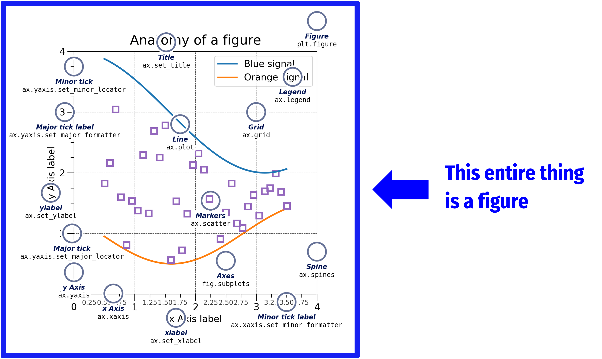

# Data Visualization: Introduction and Overview

```code
$ echo "Data Sciences Institute"
```

---

# Prerequisites

You have installed the numpy, matplotlib, pandas, scipy, PIL, and requests libraries in Python

---

# Overview of this slide deck, we will:

- Learn about matplotlib
- Produce our first data viz in Python
- Begin to modify elements of our data viz, including
    - Colour
    - Line type
    - Marker size

---

# matplotlib

---

# What is matplotlib?

- An open source package for data visualization in Python

- Developed in 2003 to emulate Matlab software

- One package, [a LOT](https://python-graph-gallery.com/) of different types of data visualizations
 
<!-- 
- The R Graph Gallery (https://www.r-graph-gallery.com/all-graphs.html) is a great source with sample visualizations (and corresponding code) that can be made with ggplot and its extensions
- Click on images to see their respective pages in the ggplot gallery

- To cite ggplot: H. Wickham, 2016. ggplot2: Elegant Graphics for Data Analysis. Springer-Verlag New York. 
-->
---

# How does matplotlib work?

- A **figure** is like a container that holds a set of  **axes**

- The axes is our actual plot or graph

- A figure can hold multiple axes (like subplots)

- Every visual element of our plots – colour, legends, axis titles and scales, text – is called an **artist** and belongs to an axes (not to a figure)

---


---



[🔗source](https://matplotlib.org/stable/_images/anatomy.png)

---


[🔗source](https://matplotlib.org/stable/_images/anatomy.png)

---

# Making a figure with matplotlib

---
# Making a basic figure with matplotlib

- First, let’s load our libraries
    ```
    import numpy as np
    import matplotlib.pyplot as plt
    import pandas as pd
    import scipy
    import PIL
    import requests
    ```

---

# Making a basic figure with matplotlib

- Next, make some sample data so that we have something to plot!
    ```
    np.random.seed(613)
    x = np.arange(50)
    y = np.random.randint(0, 100,50)
    ```

- Then make our basic scatterplot (we’ll break it down after!)
    ```
    fig, ax = plt.subplots(figsize=(5, 3))
    ax.scatter(x,y)
    ```
---

# Making a basic figure with matplotlib

- Let’s try modifying our graph
    - We want to keep our figure and axis definition the same
    - So we only edit our axis object

    ```
    fig, ax = plt.subplots(figsize=(5, 3))
    ax.bar(x,y)
    ```

---

# Making a basic figure with matplotlib

- We can also make a line plot

    ```
    fig, ax = plt.subplots(figsize=(5, 3))
    ax.plot(x,y)
    ```

---

# Activity: Try it out

Can you modify our existing code to produce a histogram?


Hint: try ‘hist’ for our axis type

---

# Activity: Try it out

Let’s try modifying our graph


```
fig, ax = plt.subplots(figsize=(5, 3))
ax.hist(y)
```

---

# Plot Labels

---

# Adding axis labels and titles

- Let’s add to the last plot we made
    ```
    ax.set_title('Total growth over time')
    ax.set_ylabel('Total growth')
    ax.set_xlabel('Years since start')
    fig.tight_layout()
    ```
---

# Modifying labels and titles

- We can modify our labels and titles’ appearance by using font dictionaries (‘fontdict’)
- First, make a dictionary with the properties we want for our labels
    ```
    font1 = {'family':'sans-serif','color':'blue','size':20}
    font2 = {'family':'monospace','color':'green','size':14}
    ```

----

# Modifying labels and titles

- Then we’ll add fontdict arguments to our previous lineplot

    ```
    fig, ax = plt.subplots(figsize=(5, 3))
    ax.plot(x,y)
    ax.set_title('Total growth over time', fontdict = font1)
    ax.set_ylabel('Total growth', fontdict = font2)
    ax.set_xlabel('Years since start', fontdict = font2)
    fig.tight_layout()
    ```

----

# Moving labels and titles

- We can move our lables with the loc argument

    ```
    fig, ax = plt.subplots(figsize=(5, 3))
    ax.plot(x,y)
    ax.set_ylabel('Total growth', fontdict = font2)
    ax.set_xlabel('Years since start', fontdict = font2)
    ```

---

# Customizing plot appearance

---

# Modifying data points

- Remake our basic scatterplot, but this time add color and marker arguments ( NOTE:  American spelling)
    ```
    fig, ax = plt.subplots(figsize=(5, 3))

    ax.scatter(x,
               y,
              marker='*',         # NEW ADDITIONS
              color = "indigo")   # NEW ADDITIONS

    fig.show()
    ```

---

# Modifying data points

We can also adjust the style and width of the line connecting our points

```
fig, ax = plt.subplots(figsize=(5, 3))

ax.plot(x,
        y,
        marker='*', 
        color = 'indigo', 
        linestyle = '--',   # NEW ADDITIONS
        linewidth = 2)      # NEW ADDITIONS
fig.show()
```
---

# Modifying data points: Colour

- We can modify colour using named colors
    - [https://matplotlib.org/stable/gallery/color/named_colors.html#sphx-glr-gallery-color-named-colors-py](https://matplotlib.org/stable/gallery/color/named_colors.html#sphx-glr-gallery-color-named-colors-py)
- Or we can use hex codes
    ```
    fig, ax = plt.subplots(figsize=(5, 3))

    # color being the new addition
    ax.plot(x,y,marker='*', color = '#7425b9’, linestyle = '--', linewidth = 2)
    fig.show()
    ```
---

# Modifying data points

Let’s customize our plot further
```
ax.plot(x,y,marker='*',
        markersize = 12,              # NEW ADDITIONS
        color = '#7425b9',
        linestyle = '--',
        linewidth = 2,
        markeredgecolor = '#fa9359',  # NEW ADDITIONS
        markerfacecolor = '#000000' ) # NEW ADDITIONS
```
---

# Grid lines

- We can add grid lines to our axis object using **.grid()**
    ```
    ax.grid(axis = 'y')
    ```

- Activity:  Can you modify the appearance (colour, width, linestyle) of our grid lines using what we learned before?

---

# Grid lines

- We can add grid lines to our axis object using **.grid()**
    ```
    ax.grid(axis = 'y')
    ```

- Activity:  Can you modify the appearance (colour, width, linestyle) of our grid lines using what we learned before?
    ```
    ax.grid(axis = 'y')

    ax.grid(axis = ‘y’, color = "blue", linewidth = 2, linestyle = '-.')
    ```
---

# Resources: Matplotlib Cheatsheets

- [https://s3.amazonaws.com/assets.datacamp.com/blog_assets/Python_Matplotlib_Cheat_Sheet.pdf](https://s3.amazonaws.com/assets.datacamp.com/blog_assets/Python_Matplotlib_Cheat_Sheet.pdf)

- [https://github.com/matplotlib/cheatsheets](https://github.com/matplotlib/cheatsheets) (with beginner, intermediate, and general tips versions)

**We haven’t covered most of what’s on the   cheatsheets   yet, but keep them for your reference!**

---

# Activity: Exploring matplotlib

---

# Activity

- Visit the Python Graph Gallery at [https://python-graph-gallery.com/all-charts/](https://python-graph-gallery.com/all-charts/)
- Select one of the visualization types that you find most interesting
- For your visualization of choice:
    1. Copy the provided code and attempt to replicate the output in Python.  NOTE:  You may have to install packages.
    2. Recall the  **aesthetic** ,  **substantive** , and **perceptual** qualities of data visualizations. Does your visualization of choice succeed in each area?

---

# Feedback!


-----

# In the next session, we'll continue with...

- How do we choose the right data visualization for a given situation?
- What does it mean for data visualization to be ‘objective’?
- Perceptual qualities of data viz


