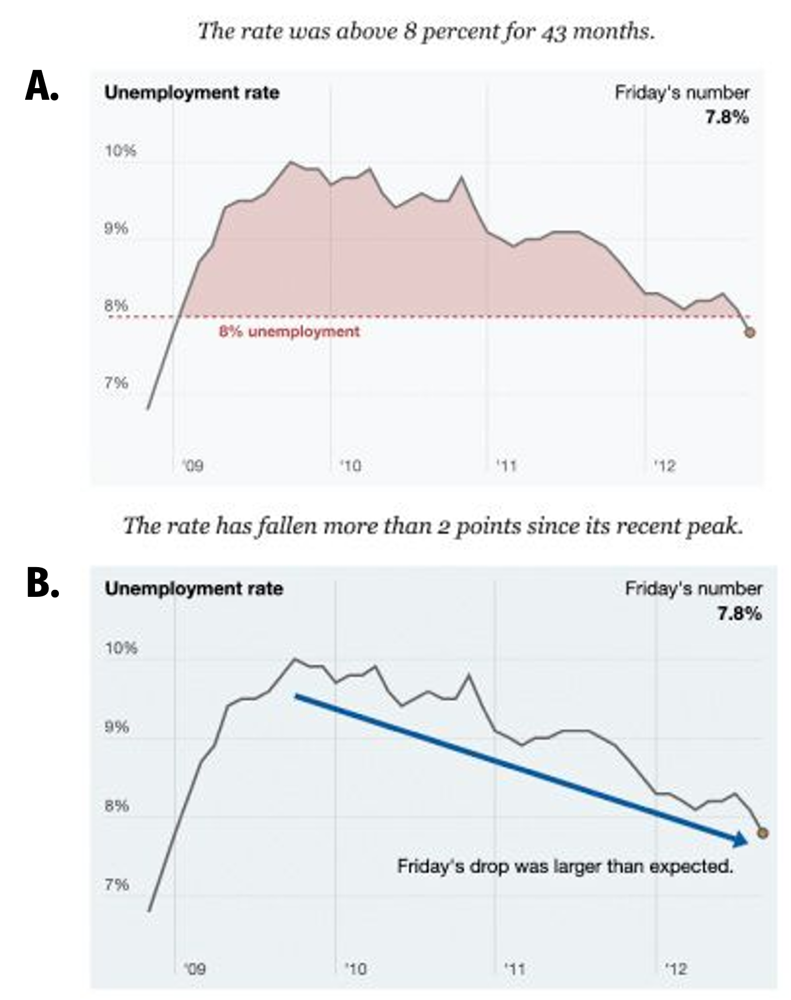
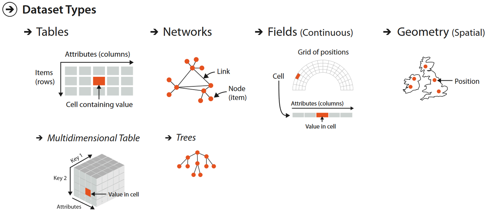
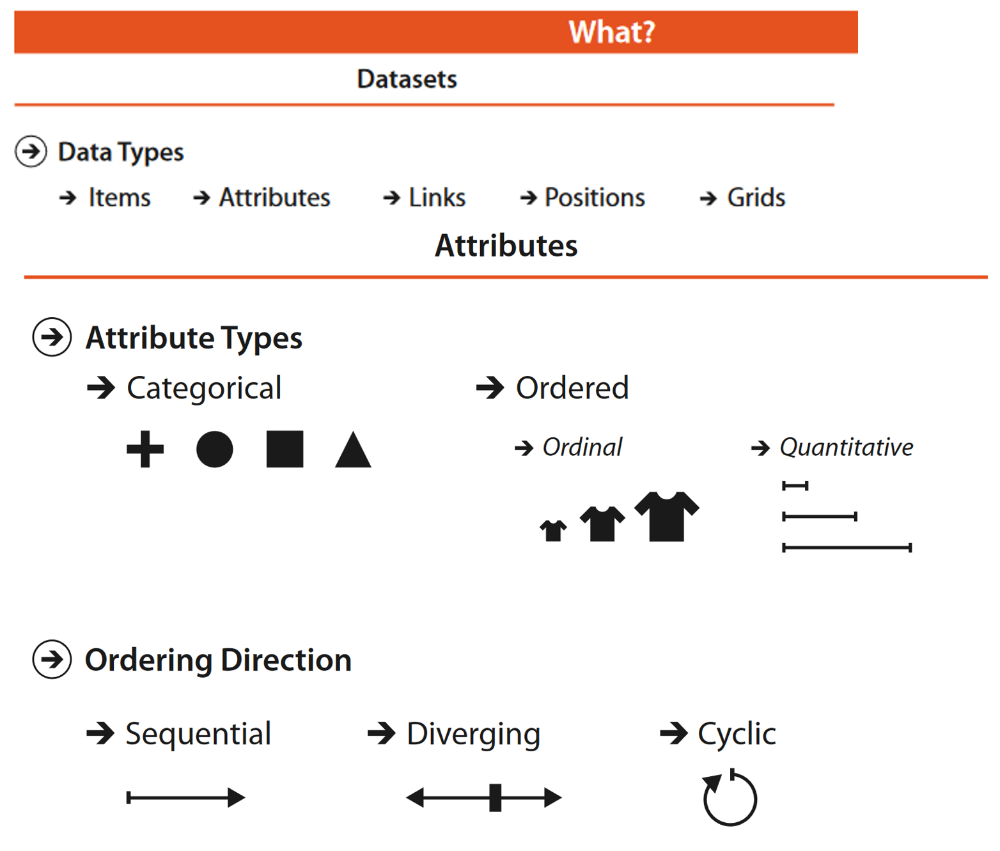
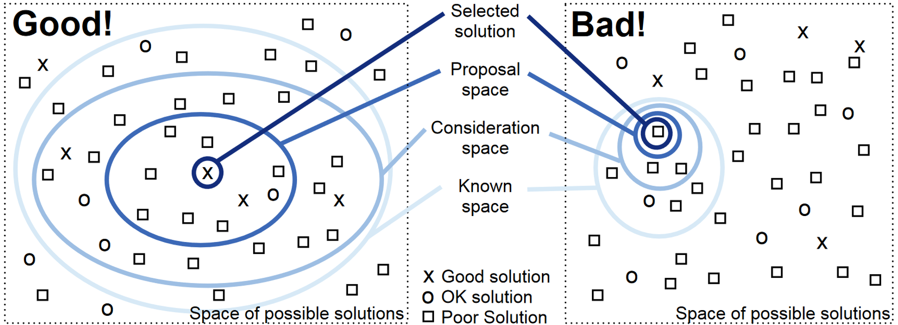
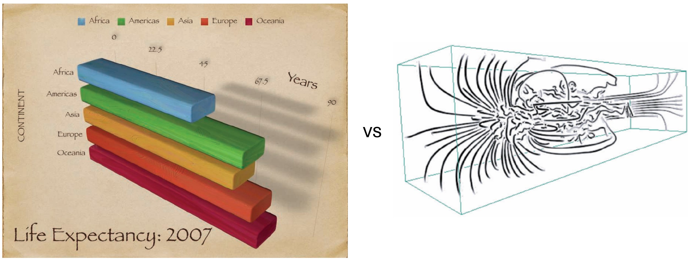

# Data Visualization: Choosing the Right Visualization

```code
$ echo "Data Sciences Institute"
```

---


# We’re going to…

- Explore how to choose the right data visualization for a given situation

- Explore  [Chapter 3 (](https://data-feminism.mitpress.mit.edu/pub/5evfe9yd/release/5)  [On Rational, Scientific, Objective Viewpoints from Mythical, Imaginary, Impossible Standpoints](https://data-feminism.mitpress.mit.edu/pub/5evfe9yd/release/5)  [) of D’Ignazio and Klein (2020). Data Feminism. MIT Press.](https://data-feminism.mitpress.mit.edu/pub/5evfe9yd/release/5)

- Discuss how ideas of neutrality and objectivity apply to data visualization

- Understand how different elements and types of data visualization are generally perceived, and use this understanding to decide what kind of visualization we should use for a particular situation

<!--
NOTES
The book cited is open access; the specific chapter is hyperlinked


REFERENCES
D’Ignazio, C., & Klein, L. (2020). 3. On Rational, Scientific, Objective Viewpoints from Mythical, Imaginary, Impossible Standpoints. In Data Feminism. MIT Press. https://data-feminism.mitpress.mit.edu/pub/5evfe9yd/release/5
-->

-----
# Agenda for today

- Go through slide deck #4: Choosing the right visualization
- Discuss assignment 2

------

# Review - How does matplotlib work?

- A **figure** is like a container that holds a set of  **axes**

- The axes is our actual plot or graph

- A figure can hold multiple axes (like subplots)

- Every visual element of our plots – colour, legends, axis titles and scales, text – is called an **artist** and belongs to an axes (not to a figure)

------

# Review - Making a figure with matplotlib

- Create a **Figure** container and one **Axes** (subplot) inside it; store them in fig and ax


```
    fig, ax = plt.subplots(figsize=(5, 3))
```

- If we color the `fig` object red and the `ax` object green, we get the following result:


-------

# Review - Making a figure with matplotlib

- Make our basic scatterplot:

```
fig, ax = plt.subplots(figsize=(5, 3))
ax.scatter(x,y)
fig.show()

```


------

# Review - Example


- Figure = the entire canvas (in red) that contains everything 

- Axes = the plotting area inside a figure (the green boxes with x/y ticks where data is drawn).

----

# Assignment Deadlines

- Assignment 2: January 26, 2026, 11:59 PM (Monday)
- Assignments 1 and 3: February 2, 2026, 11:59 PM (Monday)

-----


### - So far, we have learned how to make and modify different types of data visualizations
### - How do we decide which of these types of data visualization to use, and when?    
### - If we are accurately and honestly displaying our data, does the type of visualization even matter?

---

# How do we choose the 'right' visualization? 


---

# Activity

- We will explore two data visualizations, each showing similar datasets with different techniques
- For each visualization, discuss the following questions:
    - What information can we learn from this visualization?
    - Is this an example of objective, neutral data visualization? Why or why not?

<!--
In small groups or as a class
-->

---

# Visualization #1: US Gun Killings in 2018


[🔗 source](https://guns.periscopic.com/)

<!--
There are links on the site to sources and methodology


https://guns.periscopic.com/ 
-->

---

# Visualization #2: Washington Post Active Shooters


<!--
The source of the underlying data is shown underneath the graph
-->

---

# Visualization #1: US Gun Killings in 2018


- Periscopic’s animated visualization shows the expected years of life lost to gun violence in the United States in 2018
- It emphasizes an emotion: a sense of loss
- This visualization has been criticized as [“actively [shaping] data to support a cause”](https://data-feminism.mitpress.mit.edu/pub/5evfe9yd/release/5) (in this case, highlighting a lack of gun control in the United States)


<!--
For after discussion
-->

---

# Visualization #2: Washington Post Active Shooters 


- The next visualization shows a related dataset (about gun violence in the United States)

- Viewers will likely reach a similar conclusion as in Visualization #1, but this plot is intended to present [“a deliberately neutral emotional field, a blank page in effect, upon which viewers are more free to choose their own response to the information” ](https://data-feminism.mitpress.mit.edu/pub/5evfe9yd/release/5)

---

### What qualities or visual elements of Visualization #2 help to make it a “blank page”?

---

# A blank page


- Some of the same design elements from our ‘blank page’ Visualization #2 can be seen in this New York Times visualization of the September 2012 Jobs Report

- The clean, 2D layout is designed to avoid conveying an emotional narrative to the audience


---

# A blank page… right?

- The Jobs Report graphic was published alongside another image:


---

# A blank page

- Images A and B were designed to show the exact same data from the perspectives of Republicans and Democrats, respectively
- Image A emphasizes the unemployment rate staying above 8%, while Image B emphasizes the rate’s decline
- **Neither is technically dishonest!**



---

# Supporting a cause

- Periscopic’s Gun Killings visualization won several year-end information visualization awards
- This visualization is not neutral, and conveys an emotional narrative to the audience…
- **…But this visualization is not dishonest either!**


---

### So where does this leave us in our search for neutral, objective data visualization?

---

### Can data visualization be neutral?

---

# Short answer:
NO!

---

# “The constraints of truth leave a very wide space for interpretation…”

# [(Stray, 2016)](https://towcenter.gitbooks.io/curious-journalist-s-guide-to-data/content/)

<!--
As we saw in our examples, even if our underlying data are strictly accurate and honest, we have lots of room to make our data visualizations support a narrative or particular set of conclusions, subtly or obviously


REFERENCES:
Stray, J. (2016). The Curious Journalist’s Guide to Data. Columbia Journalism Review. https://www.cjr.org/tow_center_reports/the_curious_journalists_guide_to_data.php/
-->

---

# Data visualizations as rhetorical objects
- **Rhetoric**  is the act of communicating effectively and persuasively

- From D’Ignazio and Klein (2020),
  
    > “Any communicating object that reflects choices about the selection and representation of reality is a rhetorical object. Whether or not it is rhetorical (it always is) has nothing to do with whether or not it is true (it may or may not be).”

- That is, **we make choices about how to visualize our data, so these visualizations are not neutral…**
- **…BUT data visualizations can be factual without being neutral**

<!--
Even if we are trying to remain as neutral and objective as possible, the act of visualizing data is ultimately an act of interpretation - we make CHOICES about what to show and how to show it, thus
Data visualizations are ultimately rhetorical objects
-->

---

# Data visualization as an interpretative, rhetorical act is not necessarily a bad thing, but one that we should be aware of.

---

# Recall

- Three important qualities of data visualization:
    - Is the visualization pleasing to look at?   →  **Aesthetic** 
    - Does the visualization accurately and honestly present data? →  **Substantive**
    - Can we understand what message the maker of the visualization is attempting to convey?   →  **Perceptual**

<!--
- In our intro we briefly explored three important qualities of data visualization 
- In our reproducibility lesson we talked about how applying principles of reproducibility to our data visualization practices can support substantive data visualization
- This lesson focuses on perceptual qualities of data visualization - data visualizations are inherently rhetorical objects, so we should think about how to use that rhetoric effectively
-->

---

- Two data visualizations can share the same substantive qualities while, intentionally or not, being perceived completely differently

- When we are aware of the choices we make while creating data visualizations, we can design data visualizations that are suited to the situation at hand (perceptual qualities) without sacrificing honesty and accuracy (substantive qualities)

---

# What do we want our data visualization to do?
<!--
To do this, firstly, we need to develop an understanding of the situation
-->

---

# Intended purpose


<!--
Our first step is to clearly articulate (even to ourselves!) what the intended purpose of our data visualization is
Including
Persuasion -> trying to use our data visualization to convince someone of some position
Comparison ->  between results vs targets, changes over time, comparison between groups and sample populations
Evaluating -> Displaying experimental results or business outcomes (eg. sales)
Exploring -> attempting to make sense of complex or poorly understood datasets
-->

---

# Intended audience


<!--
Age
Education (an elementary schooler probably won’t understand error bars; an English major might have trouble interpreting a plot of biomedical lab results)
Subject matter expertise (do we need descriptive labels or not? Will people understand acronyms and units?)
Accessibility needs (colours, contrast, font size - more on accessible design in particular coming up in a later submodule)
-->

---

# Intended medium


<!--
Will the visual need to stand alone, or will there be accompanying text? Will you be there to explain it to everyone who sees it?

Print (academic journal or book, newspaper/magazine; think about colour versus grayscale printing, always check for journal specific formatting requirements)
Webpage (blog? Formal publication? Twitter thread? Is the visualization interactive or stationary?)
Poster (size? In person or virtual? Only visualization or are there many?)
Presentation (slide show? In person or pandemic-Zoom call style?)
-->

---

<style scoped>
section {
  font-size: 18px;
}
</style>


- Tables, networks, fields, and geometries are four basic dataset types. 
- For any of these dataset types, the full dataset could be available immediately as a static file or it might be dynamic data processed gradually in the form of a stream. 

<!--Tamara Munzner. 2014. Chapter 2 What: Data Abstraction. In Visualization Analysis and Design. CRC Press.-->

---



- Identifying the attribute types for our data will help us make choices about how to visualize it. 

<!--Tamara Munzner. 2014. Chapter 2 What: Data Abstraction. In Visualization Analysis and Design. CRC Press.-->

---

# Effective Visualization

- Depends on purpose, audience, and medium!
- A good goal is to satisfy: “to find one of the many possible good solutions rather than one of the even larger number of bad ones”



<!--Tamara Munzner. 2014. Chapter 1.11. Why Are Most Designs Ineffective? In Visualization Analysis and Design. CRC Press.
-->
---

# Different purpose, different results


<!--
Depending on the intended purpose, audience, and medium, each of our two earlier example visualizations could be the ‘better’ choice
-->

---

# How is our data visualization perceived?
<!--
Once we understand what we’re trying to show, to whom, and via what medium, we have targets to inform the design choices we make for our visualization
We can use existing knowledge and research about how data visualizations are perceived to make the best design choices to meet our particular goals
-->

---

# Taking advantage of cognitive psychology
- In general, data visualization takes advantage of human cognition to help us understand data more intuitively than we can if it is presented to us as a list or a table ([Li, 2020](https://www.ncbi.nlm.nih.gov/pmc/articles/PMC7303292/))
- By learning about how humans tend to process visual information, we can communicate more effectively with our graphs. For example…
- **Gestalt principles**  (Gestalt is German for shape) are a set of cognitive theories for how people tend to organize visual information; and are commonly used in UX design and data visualization ([Wong, 2010](https://www.nature.com/articles/nmeth1110-863))

<!--
cognition

REFERENCES:
Li, Q. (2020). Overview of Data Visualization. Embodying Data, 17–47. https://doi.org/10.1007/978-981-15-5069-0_2
Padilla, L. M., Creem-Regehr, S. H., Hegarty, M., & Stefanucci, J. K. (2018). Decision making with visualizations: A cognitive framework across disciplines. Cognitive Research: Principles and Implications, 3, 29. https://doi.org/10.1186/s41235-018-0120-9
Wong, B. (2010). Gestalt principles (Part 1). Nature Methods, 7(11), 863–863. https://doi.org/10.1038/nmeth1110-863
-->

---

# Gestalt principles


<!-- 
REFERENCES:
Images from https://www.interaction-design.org/literature/book/the-encyclopedia-of-human-computer-interaction-2nd-ed/data-visualization-for-human-perception
-->

---
# Gestalt principles


<!-- 
REFERENCES:
Images from https://www.interaction-design.org/literature/book/the-encyclopedia-of-human-computer-interaction-2nd-ed/data-visualization-for-human-perception  
-->

---

# Gestalt principles


<!-- 
REFERENCES:
Images from https://www.interaction-design.org/literature/book/the-encyclopedia-of-human-computer-interaction-2nd-ed/data-visualization-for-human-perception  
-->

---

# Cognitive load

- It can also be helpful to consider **cognitive load** , or the amount of work required to take in new information
- Cognitive load can be divided into:
    - **Intrinsic**(the intrinsic complexity of the new information)
    - **Germane**(the audience’s familiarity with the information)
    - **Extraneous**(complexity from how the information is presented)
- In a data visualization context, extraneous cognitive load is most within our control

<!-- 
REFERENCES:
Leppink, J. (2017). Cognitive load theory: Practical implications and an important challenge. Journal of Taibah University Medical Sciences, 12(5), 385–391. https://doi.org/10.1016/j.jtumed.2017.05.003 
-->

---

# Cognitive load

- Elements of a visualization that can affect cognitive load include:
    - **Familiar vs. Rare chart types** → rare types increase cognitive load
    - **Accurate vs.Approximate interpretation** → relational values or areas (approximate) increase cognitive load compared to absolute values or position (accurate)
    - **Concise vs. Detailed composition** → more visual elements increases cognitive load
    - **Explanatory vs. Exploratory composition** → a chart that the audience navigates alone increases cognitive load compared to a chart that they are guided through step-by-step

<!-- 
REFERENCES:
Sibinga, E., & Waldron, E. (2021, September 30). Cognitive Load as a Guide: 12 Spectrums to Improve Your Data Visualizations, Nightingale. Nightingale. https://nightingaledvs.com/cognitive-load-as-a-guide-12-spectrums-to-improve-your-data-visualizations/ 
-->

---

# Cognition over Memory
- Working memory is limited!
- It’s better to show side-by-side views than using our memory

<!--Tamara Munzner. 2014. Chapter 5 Marks and Channels. In Visualization Analysis and Design. CRC Press.-->

---

# No 3D without Cause



<!--Right image: [Image-Based Streamline Generation and Rendering. Li and Shen. IEEE Trans. Visualization and Computer Graphics (TVCG) 13:3 (2007), 630–640.]
-->

---

# Perceived factual basis

- Sociologists Kennedy et al. (2016) find that adherence to **four conventions of data visualization** reinforces the perceived objectivity and factual basis of a visualization:
    - Two-dimensional image
    - Clean layouts
    - Geometric shapes and lines
    - Inclusion of data sources at the bottom of the image

<!--
REFERENCES:
Kennedy, H., Hill, R. L., Aiello, G., & Allen, W. (2016). The work that visualization conventions do. Information, Communication & Society, 19(6), 715–735. https://doi.org/10.1080/1369118X.2016.1153126
-->

---

# Provenance rhetoric
- Citing the source(s) of our data is not only best practice (reproducibility!), but also helps people to trust our data visualizations more
- **Provenance rhetoric**  is the idea that the inclusion of a data source with our graphic signals “[transparency and trustworthiness](http://users.eecs.northwestern.edu/~jhullman/vis_rhetoric.pdf)” to the audience
- This increases the persuasiveness of the visualization, since viewers are more likely to believe what they see

<!--
REFERENCES: 
Hullman, J., & Diakopoulos, N. (2011). Visualization Rhetoric: Framing Effects in Narrative Visualization. IEEE Transactions on Visualization and Computer Graphics, 17(12), 2231–2240. https://doi.org/10.1109/TVCG.2011.255
-->

---

# Resources for choosing data visualization types

---

# Decision making tools

There are resources available online that incorporate visualization purpose and cognitive principles into reference guides to help us decide the most suitable data visualization in a given situation

<!--
REFERENCES:
-->

---

# The Data Visualization Catalogue


<!--
For example, the data visualization catalogue by Severino Ribecca (http://www.severinoribecca.one/) offers a non-code based, point-and-click interface for exploring different kinds of graphs based on intended purpose


REFERENCES:
https://datavizcatalogue.com/search.html 
-->

---

# Financial Times Visual Vocabulary
The Financial Times Visual Vocabulary help sheet is available in both [interactive](https://community.powerbi.com/t5/Data-Stories-Gallery/FT-Visual-Vocabulary-Power-BI-Edition/td-p/584460) (online PowerBI dashboard) and [PDF ](https://github.com/Financial-Times/chart-doctor/blob/main/visual-vocabulary/poster.png)versions

In both forms, the Visual Vocabulary offers a list of potential functions of visualizations, and several corresponding chart types and examples for each

<!-- 
REFERENCES:
Interactive version https://community.powerbi.com/t5/Data-Stories-Gallery/FT-Visual-Vocabulary-Power-BI-Edition/td-p/584460 
Stationary version https://github.com/Financial-Times/chart-doctor/blob/main/visual-vocabulary/poster.png  
-->

---

# Financial Times Visual Vocabulary


<!-- 
REFERENCES:
 -->

---

# Assignment 2

---

# Next session, we'll discuss: 

- More matplotlib!

