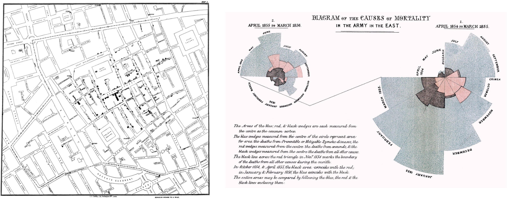

# Data Visualization: Visualization with Purpose - Data Visualization as Advocacy

```code
$ echo "Data Science Institute"
```
---

# In this class we will...

- Explore examples and ideas behind data visualization as used for advocacy

- Discuss how, through form, representation, and credit, we can put advocacy into practice with our own data visualizations

---

# Data visualization _for_ advocacy

---

# Throughout this course, we have encountered several examples of data visualization used for advocacy

---



<!--
NOTES:
- For historical examples, think of John Snow’s map tracing the source of a cholera epidemic, or Florence Nightingale’s charts of soldiers’ causes of death

REFERENCES:
- Snow, J. (1855). On the Mode of Communication of Cholera. 1855.
- Nightingale, F. (1858). Notes on matters affecting the health, efficiency, and hospital administration of the British army: Founded chiefly on the experience of the late war. Harrison and Sons. https://wellcomecollection.org/works/jxwtskzc/items?canvas=7 
-->

---


[🔗 source](https://guns.periscopic.com/)


<!-- 
NOTES:
- For a more recent example, we can think of the interactive gun deaths visualization we saw, advocating for gun control laws in the United States

REFERENCES:
https://guns.periscopic.com/ 
 -->


---

# Data visualization for advocacy

- Each of these examples is a case of data visualization being used as a tool for **advocacy**, that is, in support of some cause or goal

- Understanding the logic behind data visualization for advocacy is useful whether we want to use data to advocate for a cause, or to critically engage with data visualizations used by advocacy groups
<!-- 
NOTES: 
 
 -->

---

# Three elements of persuasion

- The Tactical Technology Collective ([2013](https://visualisingadvocacy.org/sites/drawingbynumbers.ttc.io/files/VIFA_singlepage_small.pdf)) points out that effective data visualizations for advocacy adapt and make use of Aristotle’s three modes of persuasion:
    - **Rational appeal** - idea that giving people access to the facts will let them make the ‘right’ conclusion
    - **Moral appeal** - appealing to the audience’s moral values and ethical convictions
    - **Emotional appeal** - producing and exploiting emotional reactions (e.g. empathy, compassion)


<!-- 
NOTES: 
 (TTC is an NGO that aims to explore and mitigate the effects of technology on society through a sustainability/civil rights lens)
- Recall that data visualization are inherently rhetorical objects - part of using them for advocacy is making that rhetoric as persuasive as possible

REFERENCES:
- Tactical Technology Collective. (2013). Visualizing Information for Advocacy: An Introduction to Information Design (2nd Edition). Tactical Technology Collective. https://visualisingadvocacy.org/sites/drawingbynumbers.ttc.io/files/VIFA_singlepage_small.pdf 
 -->

---

# Activity: Persuasive visualization

---

# Activity

- This diagram of the ship _Brooks_ was presented as testimony in the British Parliament to demonstrate the inhumane conditions aboard ships used by the transatlantic slave trade


<!--
REFERENCES: 
- Tactical Technology Collective. (2013). Visualizing Information for Advocacy: An Introduction to Information Design (2nd Edition). Tactical Technology Collective. https://visualisingadvocacy.org/sites/drawingbynumbers.ttc.io/files/VIFA_singlepage_small.pdf 
-->

---

# Activity

- The diagram, showing the conditions under which people were kept crowded in cargo holds for months at a time, “seemed to make an instantaneous impression of horror upon all who saw it”, supporting demands for abolition


<!--
REFERENCES: 
- Tactical Technology Collective. (2013). Visualizing Information for Advocacy: An Introduction to Information Design (2nd Edition). Tactical Technology Collective. https://visualisingadvocacy.org/sites/drawingbynumbers.ttc.io/files/VIFA_singlepage_small.pdf 
-->

---

# Activity

- How did this diagram of the Brooks use rational, moral, and emotional appeal to make a case to its audiences?

- (Larger image [here](https://upload.wikimedia.org/wikipedia/commons/8/82/Slaveshipposter.jpg))


<!--
REFERENCES: 
- Tactical Technology Collective. (2013). Visualizing Information for Advocacy: An Introduction to Information Design (2nd Edition). Tactical Technology Collective. https://visualisingadvocacy.org/sites/drawingbynumbers.ttc.io/files/VIFA_singlepage_small.pdf 
-->

---

# Different visual, same message

- At the same time that the Brooks diagram was being circulated, abolitionists also had slogans and art printed on dishware

- Rather than sharing facts, these objects were intended to provoke outrage and action in solidarity


<!--
NOTES: 


REFERENCES:
- Tactical Technology Collective. (2013). Visualizing Information for Advocacy: An Introduction to Information Design (2nd Edition). Tactical Technology Collective. https://visualisingadvocacy.org/sites/drawingbynumbers.ttc.io/files/VIFA_singlepage_small.pdf 
-->

---

# Two functions of data visualization for advocacy

- These examples, respectively, are examples of two functions of data visualization for advocacy:
    - **Presentation** - describing and depicting the facts
    - **Representation** - subjectively depicting ideas using metaphor, analogy, and allegory
- Most visuals for advocacy use both, but we should understand them as distinct elements so that we can recognize the extent to which a visual uses one or the other

<!--
NOTES: 
- As is usual for this module, it isn’t to say that one of these functions is ‘better’ or ‘worse’ than the other across all situations, but we should be cautious of when the lines between them blur

REFERENCES:
- Tactical Technology Collective. (2013). Visualizing Information for Advocacy: An Introduction to Information Design (2nd Edition). Tactical Technology Collective. https://visualisingadvocacy.org/sites/drawingbynumbers.ttc.io/files/VIFA_singlepage_small.pdf 
-->

---

# “Having heard all of this you may choose to look the other way, but you can never again say that you did not know.”
(Tactical Technology Collective, 2013)

<!--
NOTES: 
- Data visualizations are one of the most powerful tools we have for advocacy - they let us quickly and impactfully communicate important, data-supported facts to bring awareness to important causes
- The quote here is from the presentation of the Brooks diagram by abolitionists at the British Parliament

REFERENCES:
- Tactical Technology Collective. (2013). Visualizing Information for Advocacy: An Introduction to Information Design (2nd Edition). Tactical Technology Collective. https://visualisingadvocacy.org/sites/drawingbynumbers.ttc.io/files/VIFA_singlepage_small.pdf 
-->

---

# Data visualization as advocacy

<!--
Now that we have established a basic understanding of how data visualizations have been (and are!) used for advocacy, we can start to dig into some of the practices and innovations that can make the act of visualizing data one of advocacy in itself
-->

---

# Form: What can data visualization be?

- So far, the examples of data visualization that we have seen and discussed have been almost exclusively print or digital images

- Data visualization via non-traditional form and medium is a newer area, but one with exciting possibilities for both accessibility and social impact

<!--
NOTES
- Ideas and examples about pushing the boundaries of what we traditionally think of as data visualization and how we traditionally ‘do’ data visualization 
- We’ll cover interactive data viz (at an introductory/high level perspective) later; but data viz exist even further beyond the bounds of interactive images; interactivity goes beyond that
-->

---

# _Pulse_ (2012) by Jon McTaggert and Christian Ferrera


(🔗 [The Video](https://vimeo.com/45980795?embedded=true&source=vimeo_logo&owner=12584834))

<!--
NOTES: 
- Pulse uses string and motors to create real-time, tangible data visualizations of any live feed of data that can be expressed as a line graph (stock prices, heart rate, temperature, etc)
- Benefits: tactile - accessible? More visually striking/impactful?
- Costs: lack of axes/labels can make the message unclear; requires installation and some knowledge

REFERENCES:
- Anderson, P. (2014, April 22). Tangible Data Visualizations. Masters of Media (University of Amsterdam). https://mastersofmedia.hum.uva.nl/blog/2014/04/22/tangible-data-visualizations/
-->

---

# _Watermarks_ (2009) by Chris Bodle


🔗 [source](http://aprb.co.uk/projects/all-projects/2009/watermarks)

<!--
NOTES
- Data viz as advocacy not just limited to questions of accessibility
- Urban art installation in February 2009 in Bristol, England
- Projections on landmarks and buildings around the city to show the projected future water levels if current rates of climate change hold; a way of building awareness about the tangible effects of climate change on the environment around people
- Is it data viz? -> showing the results of predictions/modeling, but using real buildings and structures as reference points rather than 2D axes on a graph


REFERENCES
- Image from http://aprb.co.uk/projects/all-projects/2009/watermarks 
- Emerson, J., Satterthwaite, M. L., & Pandey, A. V. (2018). The Challenging Power of Data Visualization for Human Rights Advocacy. In J. D. Aronson & M. K. Land (Eds.), New Technologies for Human Rights Law and Practice (pp. 162–187). Cambridge University Press. https://doi.org/10.1017/9781316838952.008
-->

---

# _“Untitled” (Ross)_ (1991) by Felix Gonzalez-Torres


[🔗 source](https://www.davidzwirner.com/exhibitions/2017/felix-gonzalez-torres#/checklist/Untitled%22%22-(Ross)---artwork-ADED7A57-C921-4B8C-97D3-64F230459259/Artwork)

<!--
NOTES
- A 1991 art installation consisting of 175 pounds of individually wrapped candies, with viewers encouraged to take a piece of candy as they passed the exhibit 
- The installation was meant to represent the weight of Gonzalez-Torres’ partner, Ross, before a diagnosis of HIV/AIDS, and the gradual removal of candy, reducing the weight of the installation, demonstrating the loss of weight caused by the illness in the leadup to Ross’ death
- By having the audience participate in the removal of weight, Gonzalez-Torres was making a statement about the culpability and apathy of the general public towards the AIDS epidemic
- Tactile, interactive, creative - but fundamentally using visual representation of numbers (weight, rate of weight loss) to make a point and convey information to an audience. Data viz!!


REFERENCES
- Image from https://www.davidzwirner.com/exhibitions/2017/felix-gonzalez-torres#/checklist/Untitled%22%22-(Ross)---artwork-ADED7A57-C921-4B8C-97D3-64F230459259/Artwork  
- Emerson, J., Satterthwaite, M. L., & Pandey, A. V. (2018). The Challenging Power of Data Visualization for Human Rights Advocacy. In J. D. Aronson & M. K. Land (Eds.), New Technologies for Human Rights Law and Practice (pp. 162–187). Cambridge University Press. https://doi.org/10.1017/9781316838952.008
-->

---

# Representation: What data are we seeing?

**Recall**: Data visualizations are **rhetorical objects**, because in making them, we make choices about how to select and represent aspects of reality

- A major aspect of this choice is choosing which data to collect and translate into visual form; reproducibility helps us to understand and trace the data we see in graphics

- Just as important, but often overlooked: **which data _aren’t_ we seeing?**

<!--
NOTES
- Looking past the form and medium of our data visualizations, we should interrogate our own practices with regards to representation
- Just as important: what data _aren’t_ we seeing 
-->

---

# Representation: What data are we seeing?

- The ways that we collect data impact and limit the ways that we can later visualize those data
    - A binary ‘gender’ variable means excluding nonbinary identities from our dataset
    - Maternal mortality data are collected from all over the world, but data on other aspects of women’s lives are [overlooked](https://civic.mit.edu/index.html%3Fp=1153.html)
- “What gets counted counts”... but what about the things we do not or cannot count?

<!--
NOTES
- For review of the technical/statistical aspects of sampling, revisit Module 5: Sampling


REFERENCES 
- Seager, J. (2016). Missing Women, Blank Maps, and Data Voids: What Gets Counted Counts – MIT Center for Civic Media. https://civic.mit.edu/index.html%3Fp=1153.html 
-->

---

# Representation: What data are we seeing?

- Data, defined broadly, can include “[words or stories, colors or sounds, or any type of information that is systematically collected, organised and analysed](https://data-feminism.mitpress.mit.edu/pub/h1w0nbqp/release/3)”

- While visualizing data, we should question the ways in which our work incorporates or excludes less conventional kinds of data, including stories, artwork, and testimonials of lived experience; and the ways that these exclusions can enforce existing power structures

<!--
NOTES
- Onus is on us to find ways to respect and incorporate lived experience and qualitative data **AS WELL AS** quantitative data into academic, policy, and advocacy discussions 

REFERENCES 
- D’Ignazio, C., & Klein, L. (2020). 4. What Gets Counted Counts. In Data Feminism. https://data-feminism.mitpress.mit.edu/pub/0vgzaln4/release/3   
- Fileborn, B., & Trott, V. (2021). “It ain’t a compliment”: Feminist data visualisation and digital street harassment advocacy. Convergence, 13548565211045536. https://doi.org/10.1177/13548565211045536 
-->

---

# Credit: Data visualization as the tip of the iceberg

- The Diverse Economies Iceberg ([2017](https://www.communityeconomies.org/resources/diverse-economies-iceberg); click to view larger image) displays the idea of ‘**underwater labour**’, or the idea of work such as caregiving or domestic labour as essential to wage labour, but often unacknowledged


<!--
NOTES
 


REFERENCES 
- D’Ignazio, C., & Klein, L. (2020). 7. Show Your Work. In Data Feminism. https://data-feminism.mitpress.mit.edu/pub/0vgzaln4/release/3  
- Diverse Economies Iceberg by Community Economies Collective is licensed under a Creative Commons Attribution-ShareAlike 4.0 International License 
-->

---

# Credit: Data visualization as the tip of the iceberg

- D’Ignazio and Klein ([2020](https://data-feminism.mitpress.mit.edu/pub/0vgzaln4/release/3)) relate the idea of underwater labour to data visualization
- How many unseen contributions does it take for a data visualization to exist in its final form? Think of:
    - Community organizers who facilitated data collection
    - Designers creating colour palettes for visualizations
    - Technical writers creating alt-text and image descriptions
    - Student research assistants who recorded the data
    - IT support staff who help host the visualization online
    - Caregivers for children during project work

<!--
REFERENCES 
- D’Ignazio, C., & Klein, L. (2020). 7. Show Your Work. In Data Feminism. https://data-feminism.mitpress.mit.edu/pub/0vgzaln4/release/3  
- Diverse Economies Iceberg by Community Economies Collective is licensed under a Creative Commons Attribution-ShareAlike 4.0 International License  
-->

---

# Credit: Data visualization as the tip of the iceberg

- Data visualization is the product of a particular **data setting** and of the work people do within that setting

- By crediting all contributors, we can make the underwater labour of data visualization visible and valued

<!--
REFERENCES 
- D’Ignazio, C., & Klein, L. (2020). 7. Show Your Work. In Data Feminism. https://data-feminism.mitpress.mit.edu/pub/0vgzaln4/release/3  
- Diverse Economies Iceberg by Community Economies Collective is licensed under a Creative Commons Attribution-ShareAlike 4.0 International License 
-->

---

# Next...

- Building on matplotlib basics to explore other libraries for dataviz in Python
    - Seaborn
    - Interactive viz
    - Maps
    - Wordclouds/diagrams

