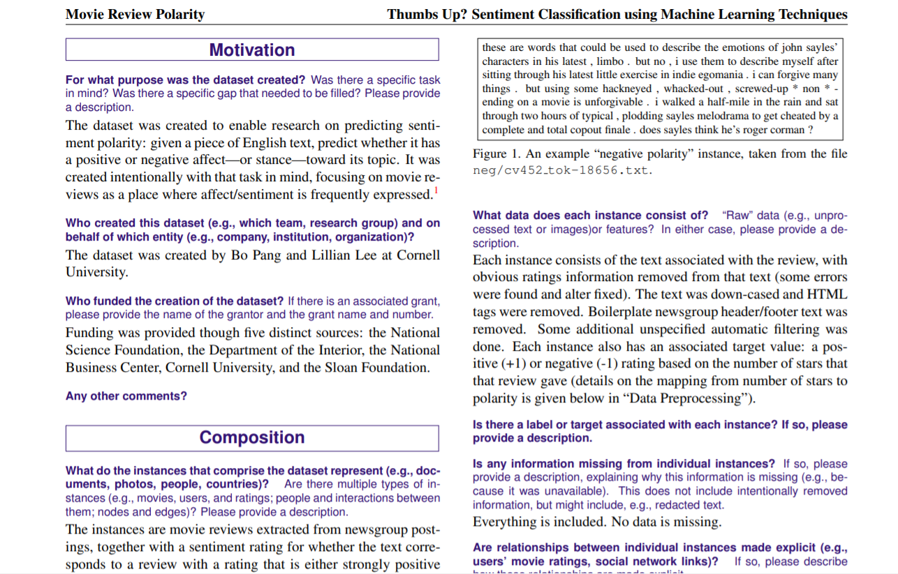

# Data Visualization: Reproducible Data Visualization

```code
$ echo "Data Science Institute"
```

---

# Today we’re going to...

- Explore why reproducibility in data visualization matters
- Understand why reproducible data visualization practices are both ethical and practical
- Discuss practices we can implement to make our data visualizations reproducible

---

# Case Study: Why should we care about reproducible data visualization?

<!-- 
To start things off, we’ll look at an example of why reproducibility is so important to us as people who want to visualize data 
-->

---

# Image Manipulation

- In 2016, a research article showing the effectiveness of a particular molecular compound as a potential cancer treatment was published
- Cell staining images were used to support authors’ conclusions


<!-- 
Referenced:
Shen, H. (2020). Meet this super-spotter of duplicated images in science papers. Nature, 581(7807), 132–136. https://doi.org/10.1038/d41586-020-01363-z 
-->

---

# Image Manipulation

- Dr. Elisabeth Bik, a microbiologist, noticed that certain features of the published images contained “problematic duplications”
- **Can you spot the duplications in the original images?**


<!-- 
Referenced:
Shen, H. (2020). Meet this super-spotter of duplicated images in science papers. Nature, 581(7807), 132–136. https://doi.org/10.1038/d41586-020-01363-z 
-->

---

# Image Manipulation

- Areas enclosed in same-coloured boxes show signs of deliberate duplication
- If the images were manipulated, can we still trust the authors’ conclusions?


<!-- 
What the duplicated sections of image tell us is that either a) the images were altered to support a conclusion that the researchers wanted to show, or b) the images were altered somewhere earlier in the process, and the authors formed their conclusions based on looking at the flawed images
Either way: how can we trust the findings when the image used as evidence has been manipulated?

Referenced:
Shen, H. (2020). Meet this super-spotter of duplicated images in science papers. Nature, 581(7807), 132–136. https://doi.org/10.1038/d41586-020-01363-z
-->

---

# Image Manipulation

- The paper was ultimately retracted because of Dr. Bik’s findings
- [Study authors said](https://journals.plos.org/plosone/article?id=10.1371/journal.pone.0207273) that the images were generated by a third party company whose involvement was not declared in the initial publication


<!-- 
Referenced: 
Editors, T. P. O. (2019). Retraction: Plumbagin Suppresses the Invasion of HER2-Overexpressing Breast Cancer Cells through Inhibition of IKKα-Mediated NF-κB Activation. PLOS ONE, 14(1), e0207273. https://doi.org/10.1371/journal.pone.0207273
-->

---

# Image Manipulation - Dr. Elisabeth Bik

- [Dr. Bik’s work](https://www.nature.com/articles/d41586-020-01363-z)  spotting manipulated figures and images in scientific publications has led to 172 retractions and more than 300 corrections
- She and her colleagues have examined >20,000 biomedical publications and found that [over 3.8%](https://journals.asm.org/doi/10.1128/mBio.00809-16) contain problematic figures, and that numbers of these figures are rising


<!-- Referenced:
 Bik, E. M., Casadevall, A., & Fang, F. C. (2016). The Prevalence of Inappropriate Image Duplication in Biomedical Research Publications. MBio, 7(3), e00809-16. https://doi.org/10.1128/mBio.00809-16
Shen, H. (2020). Meet this super-spotter of duplicated images in science papers. Nature, 581(7807), 132–136. https://doi.org/10.1038/d41586-020-01363-z -->

---

# Why is this so important?

---

- ### Images and visualizations are often the best way to communicate our data and insights...

- ### **But** if we can’t trust that visualizations are representing the ‘real’ data, we can’t trust what their creators are trying to communicate...

- ### **So** how can we ensure that the visualizations we create are representing our data with integrity?

---

# Reproducibility

---

# What is reproducibility?

- **Reproducible work** is “capable of being checked because the data, code, and methods of analysis are available to other researchers”
    - That is: someone could repeat the steps we took to generate a particular result or image from our data
- The figures in the case study we saw were  not  reproducible, because they were made by an unknown third party using unclear methods
- Reproducibility of data is a  [hot topic](https://www.ncbi.nlm.nih.gov/books/NBK547546/)  across professional and academic research contexts, and increasingly a  [requirement ](https://www.ncbi.nlm.nih.gov/pmc/articles/PMC4831566/) for publication


<!-- 
Recall: back in 7.1 we talked about substantive qualities of data viz (AKA viz that accurately and honestly present their data); reproducibility is a way of supporting those substantive qualities


Referenced: 
National Academies Press. (2019). Understanding Reproducibility and Replicability. In Reproducibility and Replicability in Science. National Academies Press (US). https://www.ncbi.nlm.nih.gov/books/NBK547546/ 
Allison, D. B., Brown, A. W., George, B. J., & Kaiser, K. A. (2016). Reproducibility: A tragedy of errors. Nature, 530(7588), 27–29. https://doi.org/10.1038/530027a  
-->

---

# Reproducibility is ethical

- The American Statistical Association’s  [Ethical Guidelines for Statistical Practice](https://www.amstat.org/ASA/Your-Career/Ethical-Guidelines-for-Statistical-Practice.aspx) state that “Good statistical practice is fundamentally based on transparent assumptions, **reproducible results**, and valid interpretations”
- Recall from last class that **visualizing data means making decisions**
- Reproducibility helps to hold us accountable for those decisions

<!-- 
Referenced:
Committee on Professional Ethics of the American Statistical Association. (2018). Ethical Guidelines for Statistical Practice. https://www.amstat.org/ASA/Your-Career/Ethical-Guidelines-for-Statistical-Practice.aspx 
-->

---

# Reproducibility is practical

- Making data visualizations reproducibly is  **practical**  as well as  **ethical**:
    - Makes it easier to make changes if we have to edit a plot or image weeks or months after its creation
    - Helps us to draw on previous work to make new graphics more easily
    - Useful for version control because we can easily see where exactly we made changes

<!-- 
Healy 2.1
-->

---

# NOTE: 
**The ability to reproduce a result does not necessarily indicate correctness, nor does the inability to do so mean a result is incorrect.**

But “science is incremental: it is only through transparency and by enabling reproducibility that scientific knowledge evolves.”

<!-- 
Reproducibility doesn’t mean that a result is correct, but it does give us the ability to evaluate that correctness for ourselves in a critical, thorough fashion

Referenced: 
Fekete, J.-D., & Freire, J. (2020). Exploring Reproducibility in Visualization. IEEE Computer Graphics and Applications, 40(5), 108–119. https://doi.org/10.1109/MCG.2020.3006412 
-->

---

# So how can we make our data visualizations reproducible?

---

# Work programmatically

- We want to do as much work on our figures as possible **programmatically**

- This means we want to make our images in code (eg. ggplot in R, matplotlib in Python) rather than in programs like Adobe Illustrator, where changes and data sources are harder to trace

<!-- 
Healy 2.1
 -->

---

# Work in plain text

- Code should be written in a **simple, plain-text format** (eg. R scripts or .txt files)
- Code should **not** be written in a word processor (eg. Microsoft Word)
- Ideally, our ‘pretty’ final products (images, graphs, charts) can be procedurally (and reproducibly!) generated just by running our code

<!-- 
Healy 2.1
 -->

---

# Comment your code

- When others (or us, at a later date) want to look back at the code we used to make our data visualizations, comments can help us to make sense of what choices were made and why

- [Comments make code](https://ieeexplore.ieee.org/abstract/document/6613836?casa_token=-k5QM2be9J0AAAAA:ACauiklkZMreWrPLTfrOzOksVgdEnF9ntoKDXuoF6q8hHJ8i_67a3Gw5OE3l_NhLJ-n2OqzJJj8&signout=success)  easier to understand, maintain, and update

<!--
Referenced:
Healy 2.1
Steidl, D., Hummel, B., & Juergens, E. (2013). Quality analysis of source code comments. 2013 21st International Conference on Program Comprehension (ICPC), 83–92. https://doi.org/10.1109/ICPC.2013.6613836
-->

---

# Activity: Comment our code

- Let’s return to our saved code from practicing making a plot in Python using matplotlib
- We can add comments to our code by preceding them with ‘#’ OR by using markdown cells (in Jupyter Notebooks)
- Take a few minutes to comment your code, and then return and discuss what you did
    - What information is it helpful to include?
    - How do you write a ‘good’ comment?

---

# Datasheets for datasets

- Gebru et al. ( [2020](http://arxiv.org/abs/1803.09010) ) propose that datasets be accompanied by a datasheet that “documents its motivation, composition, collection process, recommended uses”, etc

- Datasheets can facilitate connections between the underlying data and the final analytical products (in our case, images and figures)

<!--
Referenced:
Gebru, T., Morgenstern, J., Vecchione, B., Vaughan, J. W., Wallach, H., Daumé III, H., & Crawford, K. (2020). Datasheets for Datasets. ArXiv:1803.09010 [Cs]. http://arxiv.org/abs/1803.09010
-->

---

# Datasheets for datasets - Sample datasheet



<!-- 
NOTES: 
Follow the hyperlink to the gebru paper and scroll, walk through the example datasheet in more detail and discuss useful elements

Referenced:
Gebru, T., Morgenstern, J., Vecchione, B., Vaughan, J. W., Wallach, H., Daumé III, H., & Crawford, K. (2020). Datasheets for Datasets. ArXiv:1803.09010 [Cs]. http://arxiv.org/abs/1803.09010 
-->

---

# Next...

- Customizing our plots
    - Adding legends
    - Annotating our plots
    - Working with colour
    - Pre-made styles
- Choosing the right graph for a given situation (Professional skills)

